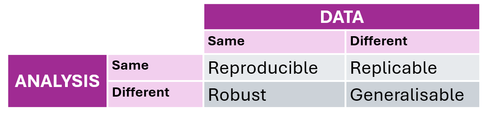

# Open, reproducible and ethical science
Intro paragraph

## Reproducibility Crisis

Over the past few decades, scientific research has become increasingly fast-paced, with a "publish or perish" culture firmly embedding itself in the scientific community’s consciousness [REFERENCES]. This mindset exerts significant pressure on researchers to continuously publish in order to secure funding and advance their careers [REFERENCES]. This pressure to publish (predominantly statistically significant results), is closely tied to what is known as publication bias. In published academic research, publication bias occurs when the outcome of an experiment or research study biases the decision to publish or otherwise distribute it. This typically results in a preference for publishing significant or positive results, disrupting the balance of findings and favouring those that are deemed novel or noteworthy. Whilst negative or inconclusive results are rarely published or considered less worthy of publication [REFERENCES].

Examining this bias towards positive results reveals substantial evidence of a troubling trend: an overrepresentation of false-positive findings in the scientific literature. This bias towards positive results has several concerning and wasteful consequences, including, but not restricted to: a significant number of valid negative results remaining unpublished, which excludes critical findings from the scientific record. This means that other research teams, unaware of these unpublished negative results, may continue to unknowingly test the same hypotheses (which may actually be false) until, by chance or artifact, a positive result is obtained. These chance positive results are then published (as they align with the preference for significant findings), even when substantial and more definitive contradictory evidence may exist in contrast to it [REFERENCE]. What is more, this underreporting of negative results introduces bias into meta-analysis, which consequently misinforms researchers, doctors, policymakers and the public in general. Additionally, more resources are wasted on already disputed research that remains unpublished and therefore unavailable to the scientific community. 

This cycle sustains an error-prone body of scientific literature, undermining the reliability of published research. Hand in hand with this publication bias, comes something now known as a _Reproducibility Crisis_, where it is becoming increasingly apparent that making "fast-science" is associated with a lack of being able to reproduce research [REFERENCE]. While one may not directly cause the other, they are closely intertwined. The reproducibility crisis has been in the rise for the past few decades as we uncover the fact that much of the research that is published fails to be reproduced by others. To give some examples, a survey of 1576 scientists published in Nature (Baker, 2016) reported that over 70% of the participants failed to reproduce others’ experiments and over 50% failed to reproduce their own results. Similarly, @tiwari2021ReproducibilitySystemsBiology assessed the reproducibility of 455 mathematical models in systems biology and found that about 50% of published models were not reproducible either due to incorrect or missing information in the manuscript [REFERENCE].

Much of the criticism surrounding the reproducibility crisis centres on statistical methods and research practices [REFERENCES]. Problematic scientific behaviours, such as HARKing (Hypothesising After the Results are Known), p-hacking (manipulating data analysis to achieve statistical significance), and selectively reporting only positive outcomes, as discussed above, have been identified as major contributors to irreproducibility [REFERENCES]. Indeed, this reliance on p-values, provided they meet the conventional threshold of statistical significance (typically p < 0.05), can sometimes lead to studies being treated as definitive evidence, even when their findings are not robust or reproducible [9–11]. 

The list of factors contributing to irreproducibility is extensive, and is not restricted to statistical methods. A lack of access to raw data or, in some cases, outright data fabrication also plays a role [REFERENCE]. Ambiguities in experimental procedures, materials, and data processing steps further undermine research reliability [REFERENCES]. On a broader, more systemic level, there's an important discussion regarding how current academic systems often prioritize novelty and statistically significant findings, as research funding is more likely to be secured and promoted when the outcomes are more profitable [REFERENCES]. Although these behaviours fall under scientific misconduct [REFERENCE: https://publications.parliament.uk/pa/cm5803/cmselect/cmsctech/101/report.html] and are not considered acceptable scientific practice, they continue to occur.

Interestingly, a large-scale survey of nearly 6,000 academic psychologists (with 2,155 responses) assessed self-reported engagement in some of these questionable research practices known to introduce bias into research findings. Notably, respondents often justified their own use of these practices while simultaneously viewing them as unacceptable when used by others. As the authors put it, “Respondents considered these behaviors to be defensible when they engaged in them [...] but considered them indefensible overall” (p. 530). This is just one example, and it is worth noting that scientific standards and methodologies continuously evolve, meaning that questionable research practices are not static. Methods once tolerated, or even considered standard, may now be recognised as problematic, reflecting our ability to reassess and refine ethical and methodological frameworks. Encouragingly, awareness of the reproducibility crisis is growing, and there is a gradual shift towards promoting open and reproducible research practices [@umbach2024Open, @nature2018Challenges]. Before we explore the work being done to promote science as more open, reproducible, and ethical, it’s important to first agree on what we mean by these terms in this thesis.

## Defining Reproducibility

There is a long history of the terms reproducibility and replicability being used interchangeably, or their meanings being swapped depending on the field of study [@claerbout1992ElectronicDocumentsGive], [@ivie2018ReproducibilityScientificComputing],[@plesser2018ReproducibilityVsReplicability]. For example, a review on the usage of reproducible/replicable meanings [@barba2018TerminologiesReproducibleResearch] showed that most papers and disciplines use the terminology as defined by Claerbout and Karrenbach, whereas microbiology, immunology and computer science tend to follow the Associtation for Computing Machinery use of reproducibility and replication given by [@ivie2018ReproducibilityScientificComputing]. In political science and economics literature, both terms are used interchangeably. So this quickly shows how having a lack of agreement on such definitions can add even more confusion to the mix. 

In this PhD, we use the definition used by [@turingwaycommunity2019TuringWayHandbook], where reproducible research is understood as "_work that can be independently recreated from the same data and the same code that the original team used_". Reproducible, replicable, robust and generalisable have different meanings as described in the table below.

{#fig-repro-definitions width=65%}

- **Reproducible research**: is obtained when same analysis is performed on the same data, to produce the same results.

- **Replicable research**: refers to conducting the same analysis on different datasets, resulting in qualitatively similar outcomes. 

- **Robust research**: entails subjecting the same dataset to different analysis workflows to address the same research question, such as employing distinct pipelines in R and Python. Robustness demonstrates that findings can remain consistent regardless of different methods used for analysis, indicating validity and resilience to various factors like changes in conditions or methods (such as different programming languages).

- **Generalisable research**: refers to findings or conclusions that can be applied beyond the specific context in which they were derived. It indicates that the results are not limited to a particular dataset, methodology, or experimental setup, but instead can be extended to broader populations, situations, or conditions. By combining replicable and robust research, we can obtain more generalisable results. Generalisability is important as it allows us to make inferences for bigger groups of datasets, for example a target population, by only studying a part of it (the sample).

## Defining Open Science

Open science is an approach to the scientific process that promotes cooperative work and new ways of diffusing knowledge accessible to everyone, without barriers such as paywalls or restrictions on use. By making research more accessible and transparent, open science seeks to accelerate scientific progress, enhance reproducibility, and increase the societal impact of research findings. An whilst there are varying ways of defining what this "opennes" means for different contexts [REFERENCES], a definition provided by @vicente-saez2018Open gives an overall good idea of what open science is referring to: "_Open Science is transparent and accessible knowledge that is shared and developed through collaborative networks [it] helps the scientific community, the business world, political actors, and citizens [...] and stimulates an open debate about the social, economic, and human added value of this phenomenon._" Additionally, The United Nations Educational, Scientific and Cultural Organization (UNESCO) promote the following message in their Recommendation on Open Science: "_By promoting science that is more accessible, inclusive and transparent, open science furthers the right of everyone to share in scientific advancement and its benefits as stated in Article 27.1 of the Universal Declaration of Human Rights_".

Open Science overlaps with other concepts such as Open Data [REFEREENCE DEFINTION], Open Source Software and/or Hardware [REFEREENCE DEFINTION] and Open Access [REFEREENCE DEFINTION] among others [REFERENCES]. The Turing Way Booklet [@turingwaycommunity2019TuringWayHandbook] provides in-depth definitions and resources on these topics. However, let’s summarize them here to ensure we’re all on the same page. Open Data refers to the openness and accessibility of data. It involves thinking about data sharing, privacy, and protection, as well as considerations like consent and the nuances of handling sensitive data. In the context of computational projects like this PhD, Open Source applies to both software (e.g., programs and applications used) and hardware (e.g., types of machines involved) that are publicly accessible, allowing anyone to view, modify, use, and distribute them, usually under open licensing* [LINK REFERENCE]. Open Access refers to how freely available research content is. There are different ways to achieve this. Some times, open access might involve paying an Article Processing Charge to a journal, which then publishes the final version of the article under an open license, making it permanently free to access online (this is known as Gold Open Access). Sometimes, it may involve self-archiving a version of the research, often alongside preprints, allowing public access without direct journal fees (this is known as Green Open Access).

In order to achieve Open Science, [@turingwaycommunity2019TuringWayHandbook] and [@heise2020OpenAccessOpen] suggest that the research process should:

1.	**Be publicly available**: It's hard to benefit from knowledge hidden behind barriers like passwords and paywalls.

2.	**Be reusable**: Research outputs should be licensed adequately, informing potential users of any restrictions on reuse.

3.	**Be transparent**: With appropriate metadata to provide clear statements of how research output was produced and what it contains.

Additionally, Open Science and its various elements fall within the broader concept of Open Scholarship. Open Scholarship promotes transparency and accessibility in teaching, learning, research, and academia [@emeryLibGuides]. More importantly, Open Scholarship emphasizes equity, diversity, and inclusion, ensuring that knowledge is openly available to everyone, regardless of ethnicity, gender, sexual orientation, or other factors.

It is worth noting that Open Science is not “sharing absolutely everything”. Many fields of science involve working with sensitive personal data, with medical research being the most obvious example, where data is not to be widely shared. Likewise, privacy and data protection, as well as consent, and national and commercially sensitive data can be some of the most common examples of when data cannot always be open [@regulation2016RegulationEU2016]. If access to data needs to be restricted due to security reasons, however, the justification for this should be made clear. Free access to and subsequent use of data is of significant value to society and the economy. The concept of Open Science views that data should, therefore, be open by default and only as closed as necessary [REFERENCE]. 

## Defining Ethical and FAIR Science
Together with open and reproducible science, comes ethics. Scientific ethics are the standards of conduct for scientists in their professional endeavours. Ethics can be understood as a set of moral principles and values a certain society follows. Doing science with principles of ethics is believed to be the bedrock of scientific activity. However, ethical beliefs change throughout human history, and therefore so does the science being done. Science carries a heavy weight of not only unethical but oppressive research that has undermined minoritised groups and individuals throughout its history. In CHAPTER [DATA HAZARDS PAPER]. 

And so as ethical values vary and evolve throughout time, ethical guidelines also vary between who is defining them; different bodies define ethical research using different definitions. For example, the National Institutes of Health (NIH) defines research as ethical if it follows the guidelines of being of social and clinical value, that it upholds scientific validity, that has fair subject selection, that has a favorable risk-benefit ratio, follows independent review and informed consent, and finally research that shows respect for potential and enrolled subjects. Likewise, ethical considerations vary depending on the topic of research, as different factors need to be taken into account. 

Here we focus on research ethics that is most applicable to Neuroscience and data intensive projects generally, but will discuss in depth ethical considerations to be taken for this PhD project in particular too. 

We might like to think that scientific research is objective, and simply measuring reality. The reality, however, is that many decisions will be taken when doing research, and these decisions will impact the results of that research. Decisions taken in any kind of research can and will vary depending on the background of the human making these decisions, their socio-economic upbringing, religious beliefs and personal biases will affect the research even if it is unconsciously. 

Science and philosophy both seek to understand the world, but they take different approaches nowadays. Science relies on empirical evidence and aims for practical applications, while philosophy explores conceptual frameworks and seeks a deeper understanding of the fundamental nature of reality. While these distinctions help clarify the differences between Science and Philosophy, it's essential to note the overlap and interdisciplinary collaboration between the two fields. Some questions may be addressed by both science and philosophy, and insights from one field can inform the other. This separation often makes it seem like you have a choice to make: are you going to do Philosophy, or are you going to do Science? 

When I studied Neuroscience as an undergraduate, I remember wanting to discuss more of the Philosophy and Ethics of the subjects in my degree: Why do we study this topic in this way, what are the possible consecuences of this research, how ethical is this research on animals? Instead, the most philosophising I got was learning about the different streams of consciousness theories, and that's about it. Even now, I find a constant separation between Philosophy and Neuroscience - the call for this paper makes it clear: *"Neuroscientists share common interests with philosophers, but the two groups use very different approaches"*. The apparent separation of Philosophy from STEM (Science, Technology, Engineering and Mathematics) and viceversa is an unfortunate development of the 19th century, as this separation has not always existed [REFERENCE]. I call it an "apparent separation" because although it may seem they have been separated as we continue to study them individually, they are persistently intertwined. In my opinion, it is not only impossible to separate them, but I argue that separating (Neuro)Science from Philosophy can be a dangerous thing. In this paper, I'll explore potential dangers across my PhD research life cycle, offer neuroscience examples, and demonstrate how the Data Hazards framework aids in discussing philosophical and ethical issues in neuroscience.

 - probably want to add philosophy and ethics discussion after repro section and LINK WITH DATA HAZARDS. 

## Why are reproducibility and open science important?
Creating open practices has multiple benefits. Firstly, researchers can benefit from it first hand by creating open access articles, as these have been shown to be cited more often [@mckiernan2016HowOpenScience]. Another benefit of openness is that while research collaborations are essential to advancing knowledge, identifying and connecting with appropriate collaborators is not trivial. Open practices can make it easier for researchers to connect by increasing the discoverability and visibility of one’s work, facilitating rapid access to novel data and software resources, and creating new opportunities to interact with and contribute to ongoing communal projects. Creating science that follows the open definitions above can therefore also foster a deeper sense of community, which contrasts starkly with the usual competitiveness of science. 

---
## Why are reproducibility and open science important?

OPEN:

REPRO:
REPLI:

ALL OF THESE FALL UNDER THE UNBRELLA OF FAIR: 

----
Scientific standards and methodology evolve over time, and so therefore questionable research practices are ever changing. There may have been practices that were once tolerated, or even considered standard, but that are now seen as problematic, highlighting the capacity to change our view of what is and isn't acceptable. In fact, not all is lost, as there is is a shift that is slowly making its way to bring awareness around the current crisis, and Open and Reproducible practices are being promoted more. 

 and certain past practices, once tolerated, are now seen as problematic —even when they were previously considered standard.

 and how this is closely tied to funding structures, as research funded by industry may be biased towards more profitable outcomes, leading to selective reporting or manipulated data [REFERENCES]. Some of these behaviours are considered scientific misconduct [REFERENCE: https://publications.parliament.uk/pa/cm5803/cmselect/cmsctech/101/report.html], and it is admitedly not what is propoulsed as adecuate behaviour. Interestingly, a survey of almost 6000 academic psychologists (of which 2,155 responded) questionnaires were emailed soliciting self-reported performance of 10 questionable research practices, which included some of the behaviours mentioned here, known to bias research results.

 iNTERESTIGLY, “Respondents considered these behaviors to be defensible when they engaged in them . . . but considered them indefensible overall” (p. 530) [scientific methodology evolves over time, which is one reason tolerance was previously recommended for some past sins—even the one attributed to our hypothetical graduate student

--
However, not all is lost. There is a shift that is slowly making its way to bring awareness around the current crisis, and Open and Reproducible practices are being promoted more. 

dditionally, the high rate of failed replications may be linked to the flawed yet widely accepted approach of treating a single study as definitive evidence, provided it meets the conventional threshold of statistical significance (typically p < 0.05). 

However, the list of factors contributing to irreproducibility is extensive. A lack of access to raw data or, in some cases, outright data fabrication also plays a role [REFERENCE]. 

However, the list of factors contributing to irreproducibility is expansive. For example, lack of raw data or data fabrication is another possible cause [REFERENCE], that has been proven to happen. Additioally, several methodologists have pointed out [9–11] that the high rate of nonreplication (lack of confirmation) of research discoveries is a consequence of the convenient, yet ill-founded strategy of claiming conclusive research findings solely on the basis of a single study assessed by formal statistical significance, typically for a p-value less than 0.05. In other words, once a positive result is published for a study, there is a high chance it will be taken as a-ok to go ahead ebacsue of the the p value but maybe its not reproducible!!! what does this say - [need references: once study is positive, uused even if not reprducible]

(p-harcking)

(reword end of this paragraph as something more like: the book provides a good overview of this and is a helpfulresource for an overview).

_Much of the criticism and comment about reproducibility and solutions to the crisis focuses on statistics and methodology [REFERECES], in particular the rise of false positive res

and then there is the thing about the changing meaning of reproducibility/replicability [@tiwari2021ReproducibilitySystemsBiology]

_Inappropriate practices of science, such as HARKing, p-hacking, and selective reporting of positive results, have been suggested as causes of irreproducibility. In this editorial, I propose that a lack of raw data or data fabrication is another possible cause of irreproducibility._No raw data, no science: another possible source of the reproducibility crisis miyakawa._

	
“Respondents considered these behaviors to be defensible when they engaged in them . . . but considered them indefensible overall” (p. 530) [scientific methodology evolves over time, which is one reason tolerance was previously recommended for some past sins—even the one attributed to our hypothetical graduate student]. - a point to mention
--

tHIS AY WE START to see how Publication bias is closely tied to a preference for publishing "positive" or "novel" findings, while negative or inconclusive results are rarely published or considered less publishable [REFERENCES]. Examining this bias toward positive results reveals substantial evidence of a worrying trend: an overrepresentation of false-positive findings in the scientific literature. 

This bias towards positive results science has some concerning and wasteful consequences, for example: A significant number of valid negative results remain unpublished, leaving these critical findings out of the scientific record.
Other research teams, unaware of these unpublished negative results, may test the same hypotheses (which are actually false) until, by chance or artifact, a positive result emerges.
These chance positive results are then published (since they align with the preference for positive findings), even if there is substantial contradictory evidence that is far more definitive.This cycle ultimately perpetuates an error-prone body of scientific literature, exacerbating the reproducibility crisis and undermining the reliability of published research. As noted in The Problem with Science: The Reproducibility Crisis and What to Do About It, this problematic loop demands a critical reevaluation of how scientific findings are published and rewarded.
--

pressuring researchers to continuously publish in order to secure funding and advance their careers [REFERENCES]. tHIS PUBLISH OR perish mindset is well known to scientisists, and is also known as publication bias, where scientists are more liKely to succeed in their careers if they have more publications [reference].  This ublication bias is tightly linked to publishing "positive" or "novel" results, where negative results are hardly published or less likely to be publishable [references]. When one starts looking deeper into this publication of positive results bias, one starts to find hefty evidence that there is a high nuber of false-positive results that happens when science is continually based on potive results-mostly. Where  Even if the majority of these positive effects are not the product of questionable research practices specifically designed to produce positive f indings, and 2. If an unknown number of correct negative effects are not published, then 3. Other investigative teams (unaware of these unpublished studies) will test these hypotheses (which in reality are false) until someone produces a positive result by chance alone— or some other artifact, which 4. Will naturally be published (given that it is positive) even if far more definitive contradictory evidence exists— therefore contributing to an already error- prone scientific literature._ (The problem with science : the reproducibility crisis and what to do about it).

This fast-paced environment has com hand in hand with  what is now referred to as the "reproducibility crisis." For instance, studies on reproducibility [insert specific findings or statistics about the crisis here] reveal concerning trends. 

There is increasing awareness, need and want for more open, reproducible and overall FAIR science. In the past 60 years, science has been speeding up, and the publish or perish mindset is not uncommon among scientists who need to publish more and more in order to get more funding [REFERENCES]. Hand in hand with this fast-science, has come something we now call a "reprodicibility crisis", where [enter facts of reproducibloty crisis] have found [facts]. tHIS PUBLISH OR perish mindset is well known to scientisists, and is also known as publication bias, where scientists are more lilely to succeed in their careers if they have more publications [reference]. This ublication bias is tightly linked to publishing "positive" or "novel" results, where negative results are hardly published or less likely to be publishable [references]. When one starts looking deeper into this publication of positive results bias, one starts to find hefty evidence that there is a high nuber of false-positive results that happens when science is continually based on potive results-mostly. Where  Even if the majority of these positive effects are not the product of questionable research practices specifically designed to produce positive f indings, and 2. If an unknown number of correct negative effects are not published, then 3. Other investigative teams (unaware of these unpublished studies) will test these hypotheses (which in reality are false) until someone produces a positive result by chance alone— or some other artifact, which 4. Will naturally be published (given that it is positive) even if far more definitive contradictory evidence exists— therefore contributing to an already error- prone scientific literature._ (The problem with science : the reproducibility crisis and what to do about it).

_Much of the criticism and comment about reproducibility and solutions to the crisis focuses on statistics and methodology [REFERECES], in particular the rise of false positive res

_Much of the criticism and comment about reproducibility and solutions to the crisis—both real and perceived—focuses on statistics and methodology. In the past decade, statisticians have shown how statistics may be unintentionally misused or, in some cases, intentionally abused as researchers try to produce results that appeal to professional colleagues and attract potential funders._ https://www.nature.com/articles/s41746-019-0079-z

_Several methodologists have pointed out [9–11] that the high rate of nonreplication (lack of confirmation) of research discoveries is a consequence of the convenient, yet ill-founded strategy of claiming conclusive research findings solely on the basis of a single study assessed by formal statistical significance, typically for a p-value less than 0.05. Research is not most appropriately represented and summarized by p-values, but, unfortunately, there is a widespread notion that medical research articles should be interpreted based only on p-values. Research findings are defined here as any relationship reaching formal statistical significance, e.g., effective interventions, informative predictors, risk factors, or associations. “Negative” research is also very useful. “Negative” is actually a misnomer, and the misinterpretation is widespread. However, here we will target relationships that investigators claim exist, rather than null findings._ https://journals.plos.org/plosmedicine/article?id=10.1371/journal.pmed.0020124

_Whether the large and growing preponderance of these positive results in the published scientific literatures is a cause, a symptom, or simply a facilitator of irreproducibility doesn’t particularly matter. What is important is that the lopsided availability of positive results (at the expense of negative ones) distorts our understanding of the world we live in as well as retards the accumulation of the type of knowledge that science is designed to provide._

this is something key i wanna reiterate in this thesis:

_1. Even if the majority of these positive effects are not the product of questionable research practices specifically designed to produce positive f indings, and 2. If an unknown number of correct negative effects are not published, then 3. Other investigative teams (unaware of these unpublished studies) will test these hypotheses (which in reality are false) until someone produces a positive result by chance alone— or some other artifact, which 4. Will naturally be published (given that it is positive) even if far more definitive contradictory evidence exists— therefore contributing to an already error- prone scientific literature._ (The problem with science : the reproducibility crisis and what to do about it)

bias: reporting bias, publication bias, social bias

 Selective or distorted reporting is a typical form of such bias.

 what story do i wanna tell here? 

I have spent a long time of my phd thinking about reproducibility (insert turing and ols poderation graphs and ideas of things to do), and I have found that this is actually the part of my phd I am most excited about. In this thesis, I have to write about reproducibility in a way that people know the background and where I am coming from, but at the same time not get lost in all the ideas and philosophical discussions to be had around the topic. I have also therefore made practical applications to the biological research at hand and tried to provide evidence for how I am attempting to not only practice what i preach but also to showcase how emphasis in reproducibility during a phd is possible and helpful. 

## Defining reproducibility vs replicability
There is a long history of these terms being used interchangeably, or their meanings being swapped depending on the field of study [@claerbout1992ElectronicDocumentsGive], [@ivie2018ReproducibilityScientificComputing],[@plesser2018ReproducibilityVsReplicability]. For example, a review on the usage of reproducible/replicable meanings [@barba2018TerminologiesReproducibleResearch] showed that most papers and disciplines use the terminology as defined by Claerbout and Karrenbach, whereas microbiology, immunology and computer science tend to follow the Associtation for Computing Machinery use of reproducibility and replication given by [@ivie2018ReproducibilityScientificComputing]. In political science and economics literature, both terms are used interchangeably. So this quickly shows how having a lack of agreement on such definitions can add even more confusion to the mix. 

Here, we use the definition used by [@turingwaycommunity2019TuringWayHandbook], where reproducible research is understood as "_work that can be independently recreated from the same data and the same code that the original team used_". Reproducible, replicable, robust and generalisable have different meanings as described in the table below.

{#fig-repro-definitions width=65%}

- **Reproducible research**: is obtained when same analysis is performed on the same data, to produce the same results.

- **Replicable research**: refers to conducting the same analysis on different datasets, resulting in qualitatively similar outcomes. 

- **Robust research**: entails subjecting the same dataset to different analysis workflows to address the same research question, such as employing distinct pipelines in R and Python. Robustness demonstrates that findings can remain consistent regardless of different methods used for analysis, indicating validity and resilience to various factors like changes in conditions or methods (such as different programming languages).

- **Generalisable research**: refers to findings or conclusions that can be applied beyond the specific context in which they were derived. It indicates that the results are not limited to a particular dataset, methodology, or experimental setup, but instead can be extended to broader populations, situations, or conditions. By combining replicable and robust research, we can obtain more generalisable results. Generalisability is important as it allows us to make inferences for bigger groups of datasets, for example a target population, by only studying a part of it (the sample).

## Defining Open Science

Open science is an approach to the scientific process that promotes cooperative work and new ways of diffusing knowledge accessible to everyone, without barriers such as paywalls or restrictions on use. By making research more accessible and transparent, open science seeks to accelerate scientific progress, enhance reproducibility, and increase the societal impact of research findings. In order to achieve this openness, [@turingwaycommunity2019TuringWayHandbook] and [@heise2020OpenAccessOpen] suggest that the research process should:

1.	**Be publicly available**: It's hard to benefit from knowledge hidden behind barriers like passwords and paywalls.

2.	**Be reusable**: Research outputs should be licensed adequately, informing potential users of any restrictions on reuse.

3.	**Be transparent**: With appropriate metadata to provide clear statements of how research output was produced and what it contains.

Creating open practices has multiple benefits. Firstly, researchers can benefit from it first hand by creating open access articles, as these have been shown to be cited more often [@mckiernan2016HowOpenScience]. Another benefit of openness is that while research collaborations are essential to advancing knowledge, identifying and connecting with appropriate collaborators is not trivial. Open practices can make it easier for researchers to connect by increasing the discoverability and visibility of one’s work, facilitating rapid access to novel data and software resources, and creating new opportunities to interact with and contribute to ongoing communal projects. Creating science that follows the open definitions above can therefore also foster a deeper sense of community, which contrasts starkly with the usual competitiveness of science. 

Open science is not “sharing absolutely everything”, as many fields of science involve working with sensitive personal data, with medical research being the most obvious example. Privacy and data protection, as well as consent, and national and commercially sensitive data can be some of the most common examples of when data cannot always be open [@regulation2016RegulationEU2016]. If access to data needs to be restricted due to security reasons, however, the justification for this should be made clear. Free access to and subsequent use of data is of significant value to society and the economy. That data should, therefore, be open by default and only as closed as necessary. 

## Why are reproducibility and open science important?
During my PhD work so far, one aspect of the research that has come with struggle is to find accurate parametrization of values for protein dynamics. This is a known issue for most of us who create computational models of biological systems. @wieber2020ModelsParameterizationSoftware call it an “epistemic opacity” when talking about lack of clarity in Computational Chemistry, where this opacity is entangled in methods and software alike. 

This of course leads to reproducibility issues, and as this unfolds, it becomes clear that the “untrustworthiness” of research is also an issue for many other researchers. In fact, a survey of 1576 scientists published in Nature [@baker2016500ScientistsLift] reported that over 70% of the participants failed to reproduce others’ experiments and over 50% failed to reproduce their own results. 

Interestingly, @tiwari2021ReproducibilitySystemsBiology, assessed the reproducibility of 455 mathematical models in systems biology and found that about 50% of published models were not reproducible either due to incorrect or missing information in the manuscript. Having reproducibility standards like the ones offered by the frameworks discussed above, as well as having in mind something like the reproducibility scorecard introduced by [@tiwari2021ReproducibilitySystemsBiology] (@tbl-scoreboard), can be used to overcome some of these issues.

|Score:|Questions:| 
|--     |:---------|
|1      | Are the mathematical expressions described in the manuscript/supplementary material?|
|2      |Are the parameters and entity initial levels listed (as a table) in the manuscript/supplementary material?|
|3      |Are simulation conditions including software/programming environment, algorithm, changes in parameters/concentration/states and any data normalization described under each simulation figure or attached as a supplementary material?|
|4      |Are the model code(s) for the mathematical expression and simulation shared publicly?|
|5      |Are the model codes available in standard formats, e.g. SBML, COMBINE archive, SEDML and are syntactically validated?|
|6      |Are the model codes deposited in a relevant open model database?|
|7      |Are the model codes well documented to unambiguously identify model entities/variables? (with additional annotation of reactions, mathematical expressions, events, conditions, etc. when relevant.) Are the models in standard formats such as SBML and COMBINE Archive are semantically enriched, i.e. annotated with controlled vocabularies such as Gene Ontology and ChEBI and database resources such as Gene Ontologies?|
|8      |Are the numerical results shared publicly along with the model codes?|

:Reproducibility Scorecard suggested by @tiwari2021ReproducibilitySystemsBiology {#tbl-scoreboard}

We might like to think that scientific research is objective, and simply measuring reality. The reality, however, is that many decisions will be taken when doing research, and these decisions will impact the results of that research. If decisions are not well documented, the validity of the research can become more opaque. Likewise, an important issue in scientific work that makes it difficult for other people to build on is that materials or details of analyses are not freely shared, which is why open science is important when overcoming these issues. 

When it comes to publishing results in science, there is a bias for “positive results” publications, which neglects insights from negative results that could aid in further understanding what works and what doesn’t work for different types of studies @mlinaric2017DealingPositivePublication. Underreporting of negative results introduces bias into meta-analysis, which consequently misinforms researchers, doctors, policymakers and the public in general. Additionally, more resources are potentially wasted on already disputed research that remains unpublished and therefore unavailable to the scientific community. The current competitive mindset of scientific research contributes and is worth mentioning as an important factor for this desire to find positive and novel outcomes in studies, which can sometimes lead to misinterpretation and distortion of results @fanelli2010PressuresPublishIncrease. 

These are some of the reasons why clarity, reproducibility and noting of possible unaccounted for biases, have been an important part of the way that I do research, and I have made as much of my work as reproducible and open possible, taking new items from the Turing Way booklet and Data Hazards project as main inspiration to do so.  
