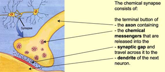

# Learning and Memory

### Abstract:
--

This PhD project investigates the temporal and spatial dynamics of NMDA receptor (NMDAR) and calcium/calmodulin-dependent protein kinase II (CaMKII) interactions within dendritic postsynaptic density. Using Monte Carlo algorithm simulations with MCell and CellBlender, I model their interactions. Throughout this project, I identify key factors influencing the efficacy and dynamics of these interactions. These findings contribute to understanding synaptic plasticity mechanisms crucial for memory formation. This chapter lays out the biological background of what we already know about how CaMKII and NMDARs are interacting to be key molecules underlying LTP and consequently learning and memory.

Am I able to reproduce results from previous undergrad thesis? or reproduce what ordyan concluded? what literature is out there already? 

## Synapses and neuronal plasticity: a brief background

Every time we learn something, neural circuits are altered in our brains. These circuits are composed of a number of neurons (nerve cells) that communicate with one another through special junctions called synapses. Synapses designate the point where the axon of one neuron connects to a dendrite of another (@fig-synapse).

{#fig-synapse}

When a nerve signal reaches the end of the neuron, it cannot simply continue to the next cell. Instead, it triggers the release of chemical messengers, called neurotransmitters, which can then carry the impulse across the synapse to the next neuron.

Once a nerve impulse has triggered the release of neurotransmitters, they cross the tiny synaptic gap and are taken up by receptors (which are proteins on the membrane) on the surface of the next neuron. The neurotransmitter thus acts somewhat like a key. If it is the right shape for the next neuron’s receptors (which act as the lock), it will produce an effect on that neuron. Neurotransmitters may have an excitatory or inhibitory effect on the neuron they reach. There are also different types of synapses, they can be chemical synapses, or electrical synapses. 

[FIGURE 2 NEEDS INSERTING]

When we learn, synapses efficiency increases, and facilitate the passage of nerve impulses along a particular circuit. For example, when we are exposed to a new word, we make new connections among certain neurons in our brain to deal with it, so some neurons in the visual cortex are needed to recognize the spelling, others in the auditory cortex to hear the pronunciation, and others in the associative regions of the cortex to relate the word to our existing knowledge. 

To learn this new word, we repeat it to ourselves several times, and this selects and strengthens the connections among these various circuits in the cortex. And it is this new, durable association among certain neurons that will form the memory of this word. Memories thus correspond to the particular activity of certain networks of neurons in our brains that have strengthened connections with one another. Synaptic plasticity is this ability of synapses to strengthen or weaken over time, in response to increases or decreases in their activity. This idea of synaptic plasticity and how memories are represented by interconnected neural circuits in the brain relates to the Hebbian theory explained below, how “cells that fire together wire together” (Figure 2).

## A brief history background on learning and memory research:

Memory can be broadly divided into declarative and nondeclarative memory [@milner1998CognitiveNeuroscienceStudy]. Declarative memory is what we ordinarily mean by the term memory and involves the conscious recollection of facts and events. Nondeclarative memory underlies the changes in skilled behaviour and its improvement with practice. The cellular changes that underline these two forms of memory differ considerably, but both are thought to involve changes in the strength of neuronal connections as proposed by @ramonycajal1909HistologieSystemeNerveux more than a century ago. The notion that synaptic strength changes during learning and memory was refined into a concrete model by @hebb1949OrganizationBehaviorNeuropsychological. Hebb proposed that if two neurons are active at the same time, the synapses between them are strengthened. He hypothesized that the neurons involved in establishing a network must already be connected by synapses in order for these synapses to be strengthened or weakened. Networks are thus created from pre-existing “wiring” (Figures 2 and 3). 

Some of these pre-wired networks, such as those in the hippocampus, then play a key role in the formation of memories. This hypothesis inspired many researchers, and the first mechanism supporting it, long-term potentiation, was discovered in the early 1970s. 

## Long Term Potentiation 

The discovery of LTP showed that short, high frequency stimulation, typically referred to as tetanus, of hippocampal excitatory synapses produced a rapid and long-lasting increase in the strength of these synapses that could persist for many days. To this day, LTP has been described at synapses throughout the brain and remains one of the most attractive cellular models for learning and memory. There are multiple forms of LTP. The variables include the type of synapse, the stimulation parameters, the time analysed after LTP induction, and the developmental age. A good example of different forms of LTP can be seen if we compare LTP at CA1 hippocampal synapses versus mossy fibre synapses at CA3 pyramidal cells. LTP at CA1 synapses, which can be representative of LTP at excitatory synapses, is dependent on NMDA receptor activation and primarily involves a modification of the postsynaptic neuron. Mossy fibre LTP , on the other hand, is independent of NMDA receptors and has been shown to be entirely expressed presynaptically @nicoll2005SynapticPlasticityHippocampal. There are also reports using rats that show a mechanistic difference between neonatal rat babies (10 days old) and more mature rats @bolshakov1995RegulationHippocampalTransmitter, @palmer2004MultipleDevelopmentallyRegulated, @yasuda2003DevelopmentalSwitchSignaling. 

An important note on bias here is necessary: Generally, when articles report on these experiments, they mention them as “animals”, instead of specifying the kind of animal, which further perpetuates the bias that they are “just animals”, hence continuing an “othering” from human animals. It also allows for a vague assumption that the results of these “animal” studies may be extrapolated to humans or other species too. The fact that these rats were raised and killed as babies, most likely through CO2 asphyxiation and how this has been shown to cause suffering @wong2013RatAversionIsoflurane, is rarely mentioned in studies where they use their hippocampal slices, instead of the whole rat. The most common way of killing rodents in science is either through carbon dioxide or decapitation, as reported by a review in 2013 in nature, and still are regularly used @cressey2013BestWayKill, @dalnegroPracticalHandbook3Rs. These topics are usually labelled in conversation as “difficult to discuss” because bringing an awareness about the suffering we cause to sentient beings hurts. There is a heavy dissonance when researchers are presented with animal research suffering and killing. Talking about sexism was never easy at the beginning (and it isn’t sometimes still), because it is difficult to admit that we are causing oppression through our actions without wanting to; talking about non-human animal suffering is equivalent to that. This is something that will ripple through this research, as I am (painfully) aware that a lot of the research knowledge that I mention is known due to non-human animal experimentation. In fact, LTP was first discovered by using rabbit’s hippocampus @lomo1971PatternsActivationMonosynaptic. 

It is LTP that depends on NMDAR activation where much research has been done @malenka2004LTPLTDEmbarrassment, @nicoll2017BriefHistoryLongTerm. Likewise, in this project we mainly focus on this type of LTP, as opposed to the ones mentioned before. Since it can provide an explanation for how we learn and form associative memories, which refers to the ability to remember visual and verbal information, such as how two words are related, for example strawberries and oranges are both fruits, or seeing an object and its alternate name. In order to fully grasp how NMDAR-dependent LTP works, and how this process includes an early phase (a component of LTP lasting 60 minutes or so), and a late phase, (a protein synthesis-dependent component of LTP), we will first have a look at two of the star proteins in this project: NMDARs and CaMKII.

## Why study CaMKII and NMDAR interactions to study memory formation?

When studying learning and memory at the molecular level, in health and disease, it has been shown that N-methyl-D-aspartate receptor (NMDAR) and Calcium/calmodulin-dependent protein kinase II (CaMKII) together with their interactions with other proteins within neuronal spines, can influence their shape and size [@fink2002MolecularMechanismsCaMKII]. Long-term modifications of synaptic strength, such as LTD (Long Term Depression) and LTP (Long Term Potentiation) involve diverse chemical pathways and have been the primary mechanisms used to study the molecular basis of learning and memory @blundon2008DissectingComponentsLongTerm. So what exactly is happening at the cellular and molecular level during memory formation? In the sections below I give a more in depth to answer this question as well as how our molecules of interest work and why we are studying them.

## NMDA receptors structure and functions
The N-methyl-D-aspartate receptor is a glutamate receptor and ion channel found in neurons. It is an ionotropic glutamate receptor. Ionotropic channel proteins open to allow ions such as Na+, K+, Ca2+ and/or Cl- pass through the membrane in response to the binding of a chemical messenger. NMDARs are permeable to Ca2+, Na+ and K+ ions and have a voltage dependent Mg2+ block. NMDARs, depending on the subunit composition, have glutamate and glycine as its ligands, the former being more common and the latter acting as a co-agonist. The binding of a ligand to NMDARs is typically not sufficient to open the channel and let ions through, as this is usually blocked by Mg2+ ions  (voltage block) which are only removed once the neuron is sufficiently depolarized. 

[INSERT FIGURE 4]

NMDARs are heterotetramers (hetero – different; tetramer – four subunits) commonly composed of two GluN1 and two GluN2 subunits. They can also be found in other conformations having GluN3 subunits. There are different subunit subtypes, for example GluN2 can be found as GluN2A, GluN2B, GluN2C or GluN2D, and we know there are GluN3A and 3B isoforms too [@ciabarra1995CloningCharacterizationChi1; @kvist2013StructurebasedDiscoveryAntagonists]. Depending on which subunits NMDARs exhibit, they will have slightly different properties and therefore different functions. There is even something called a “GluN2B-GluN2A developmental switch”, where GluN2B is predominantly present in the early postnatal brain, but switches to GluN2A during early development; eventually, GluN2A subunits become more numerous than GluN2B. These subtypes have different kinetics, and greater ratios of the GluN2B subunit leads to NMDA receptors which remain open longer compared to those with more GluN2A @liu2004SwitchingNMDAReceptor. This may, in part, account for greater memory abilities in the immediate postnatal period compared to late in life @bar-shira2015GeneExpressionSwitching. These findings were obtained from rats which were killed in order to look at certain sections of their brains.

NMDA receptor can be expressed in neuroglia, non-neuronal cells in the central nervous system with a main objective of maintaining homeostasis and myelin formation @fields2014GlialBiologyLearning. However, its expression is mainly located to dendritic spines where, through subunit-specific interactions, it connects to intracellular molecules of the postsynaptic multi-protein network, or postsynaptic density area, known as the PSD. One of the proteins that interacts with NMDARs in the PSD is CaMKII, among many others which are not included in the description of this project but can be found extensively throughout publications @volianskis2015LongtermPotentiationRole.

## CaMKII structure and functions

Ca2+/calmodulin-dependent protein kinase II (CaM kinase II or CaMKII) is a serine/threonine-specific kinase, which means it’s a protein kinase enzyme that phosphorylates the OH group of amino acid residues serine or threonine. CaMKII accounts for up to 2 percent of all brain protein and is essential for memory formation @erondu1985RegionalDistributionType, @lisman2012MechanismsCaMKIIAction. CaMKII is involved in many signalling cascades and is thought to be an important mediator of learning and memory. Depending on its component isoforms, CaMKII can also be found in cardiomyocytes for  Ca2+ homeostasis and reuptake @swaminathan2012CalmodulinDependentProteinKinase, chloride transport in epithelia @fahrmann2006FunctionalPartitioningEpithelial positive T-cell selection @mcgargill2005ActiveCa2Calmodulindependent, and cytotoxic T-cell activation. In this research we focus on CaMKII present in postsynaptic neurons which is relevant for memory formation, as explained below.

The CaMKII holoenzyme is made up of twelve subunits @bennett1983PurificationCharacterizationCalmodulindependent, @stratton2014ActivationtriggeredSubunitExchange, @bhattacharyya2016MolecularMechanismActivationtriggered, @rosenberg2005StructureAutoinhibitedKinase arranged as two rings of six. Each CaMKII subunit features an N-terminal kinase domain and C-terminal hub domain @chao2011MechanismTunableAutoinhibition. Each subunit has a hub domain, a kinase domain and a flexible regulatory domain which lends to the subunit a wide range of movement away from the holoenzyme’s central hub (Figure 5). @chao2011MechanismTunableAutoinhibition revealed the crystal structure of human alpha-CaMKII from E. coli, demonstrating its ability to transition between "docked" and "undocked" conformations. This dynamic process involves residues in the kinase domain's activation loop and a hub domain drive structure, potentially hindering CaM binding to docked subunits. Electron microscopy of rat alpha-CaMKII in Sf9 cells, as per @myers2017CaMKII, suggests that less than 3 percent of subunits adopt a compact conformation (Figure 6). This means most subunits are available for calmodulin to bind and activate, and the minority of subunits are in a state that is gnot activatable [47].

[INSERT FIGURE 5 AND 6]

In addition to docking and undocking to the CaMKII central hub, each subunit can be in an “closed/inactive” conformation when the regulatory domain is bound to the kinase domain (Fig 5B), or an “open/active” conformation when this binding is disrupted by thermodynamic effects. In the active conformation, the catalytic domain of a subunit is able to bind and phosphorylate enzymatic substrates. It has been suggested that a subunit may spontaneously return to an inactive conformation in the absence of Ca2+/CaM or phosphorylation at Thr-286 @hoffman2011Conformational.

CaMKII’s functionality is defined by various sites within its domains. For example, when CaMKII is in its undocked, open state, CaM can bind to the regulatory domain and allow for consequent CaMKII activation. Another important site is the T286 site which allows attachment of a phosphate group. One subunit can be phosphorylated and then this can autophosphorylate neighbouring subunits, keeping CaMKII in an  autophosphorylated, extended state @yang1999Structural @chao2011MechanismTunableAutoinhibition. This enables CaMKII to remain phosphorylated and activated for prolonged periods of time. LTP-induced association of CaMKII with the PSD can persist for at least 60 min after induction @lisman2012MechanismsCaMKIIAction. The T286 site can be dephosphorylated by several synaptically localized protein phosphatases, such as PP1 @shioda2017Physiological. These characteristics make CaMKII a key role player in memory formation.

Activated CaMKII can phosphorylate various other synaptic proteins, initiating a cascade of reactions that alter synaptic strength. The extent of synaptic strength effects depends on the frequency of presynaptic action potentials (APs) and the presence of other regulatory modulators that can affect the synapse's sensitivity to plasticity changes (Bartol et al., 2024: Kennedy, 2013; Kennedy et al., 2005).

## Bringing it all together: LTP, CaMKII/NMDAR complex as a molecular memory and interactions within the postsynaptic neuron

When a stimulus is received in in the postsynaptic neuron, α-amino-3-hydroxy-5-methyl-4-isoxazolepropionic acid receptor (AMPA receptors) are activated. These are another type of ionotropic  transmembrane receptor, similar yet different to NMDARs. Their activation leads to an influx of ions, and the postsynaptic neuron becomes depolarized. This depolarization will lead to NMDARs opening allowing Ca2+ to enter the cell. This rise in intracellular calcium concentrations within the PSD, then triggers a cascade of events, where Ca2+ activates a protein called calmodulin (CaM), and CaM can then activate CaMKII. The activation of CaMKII can allow for various mechanisms of LTP to proceed. CaMKII can interact with AMPAR and increase their sensitivity to further stimuli. Additionally, during early LTP, CaMKII has been shown to trigger diffusional trapping of surface AMPARs @opazo2010CaMKII. In the longer term, CaMKII can also signal for more receptors to become available in the postsynaptic membrane @lisman2012MechanismsCaMKIIAction.

[INSERT FIGURE 7]

During these processes, CaMKII can bind to NMDARs, which increases CaMKII activity @luscher2012NMDA, and determines what targets and modulators the kinase has access to thereby indirectly affecting kinase function. Neuronal CaMKII can affect synaptic plasticity in various ways. It can remain phosphorylated and active even after an initial stimulus to the neuron, which allows it to ‘react faster’ next time a stimulus is applied, leading to “molecular memory” @sanhueza2013CaMKII. CaMKII bound to actin filaments can also remodel the cytoskeleton and lead to dendritic spine growth through unbinding of CaMKII from the cytoskeleton’s actin filaments @okamoto2007Role. Therefore, these interactions can influence the shape and size of the dendritic spines, and trigger reaction cascades that ultimately lead to memory formation. 

We know that neurons’ spines change shape in response to LTP, and at the same time LTP leads to increased synaptic strength @yuste2001Morphological. CaMKII is involved in these processes; under low Ca2+ concentration, actin filaments are bundled by CaMKII. When the Ca2+ concentration is raised, CaMKII dissociates from actin and opens the window for actin remodelling. This remodelling ultimately leads to a change in the structure of the dendritic synapse @wang2019Assemblies.

## Specifics of CaMKII/NMDAR biochemical principles that underlie stable information storage by synapses

CaMKII/NMDAR molecular switch requires prevention of spontaneous transitions from on/off states.

These two stabilize the off state:
Formation of CaMKII/NMDAR comples requires release of CaMKII from actin. High phosphorylation of CaMKII by Ca (doesn't this need Calmodulin as a prior step?).  

The stability of on state depends on intersubunit phosphorylation. Intersubunit autophosphorylation is also important for understanding why the on state stability is not compromised by protein turnover (what is protein turnover? - when there is subunit exchange in proteins i think).

Note: I am bypassing acting unbinding of CaMKII, how do I argue around this for this thesis?
