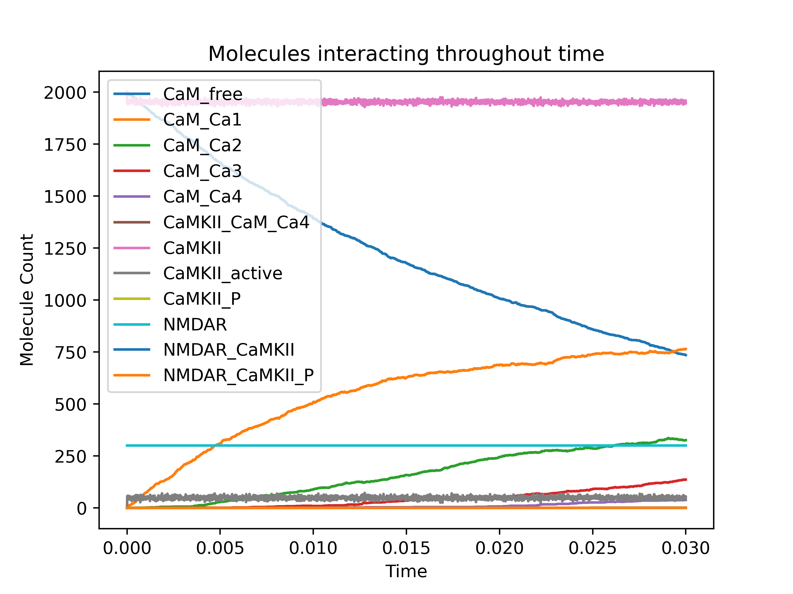
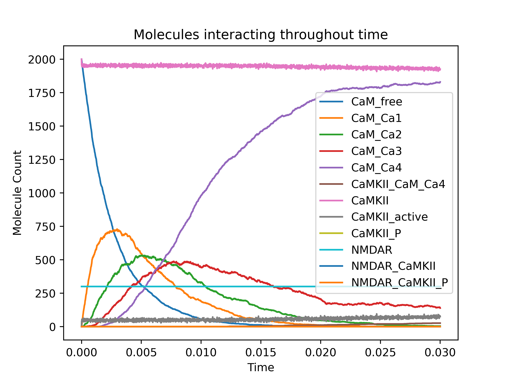

# Results

9.96181304\times10^{-8} concentration of NMDAR/CAMKII complex at equilibrium (30 molecules converted to Molar) following equation in modelling chapter. 

## CaMKII dodecamer

mutant CaMKII/NMDAR binding abolition and how this replicates in the cBNGL model too.

### Does this model reproduce previously suggested results of CaMKII activation?

### CaMKII interaction with NMDARs
our results indicate that CaMKII binds with high affinity to NR2B/C when autophosphorylated on Thr286 independent of the presence of Ca2+ and calmodulin (Fig. 1)

does our model show that camkii_p, independent of cam binding, binds at higher rates? id expect camkii_p to be found bound to nmdar independently of cam_bound_camkii, so higher number of camkii_p_camfree, and less of camkii_p_cam_ca4

->model where camkii cannot p

CaMKII/GluN2B binding requires an initial Ca2+/CaM stimulus but then persists even after dissociation of CaM from the complex. https://www.jbc.org/article/S0021-9258(20)42434-2/fulltext

Both protein phosphatase 1 (PP1) and protein phosphatase 2A (PP2A) dephosphorylated pS1303 in the GluN2B CT [17]. In the PSD, PP1 is a major phosphatase catalyzing S1303 dephosphorylation [18]. https://pmc.ncbi.nlm.nih.gov/articles/PMC4435801/

- not checking for this but for future discussions: CaMKII binding to GluN2B even blocks this phosphorylation (Bayer et al., 2001).  https://www.sciencedirect.com/science/article/pii/S0896627319304866

**Aim 1.** Develop a computational model of CaMKII/NMDAR interactions based on published models and known findings on CaMKII regulation. This way, the model itself functions as a testable hypothesis that synthesises literature knowledge about CaMKII/NMDAR interactions.

**Aim.** Perform parameter sweeps for reaction rates that have not been measured experimentally. This allows mapping the model's response to parameter changes and determining plausible ranges of the unknown parameters.

**Aim 2.** Determine in detail how functional states of CaMKII contribute to stabilizing the CaMKII/NMDAR complex, defined as achieving long-lasting binding that reaches equilibrium. This includes investigating how conformational states of CaMKII and phosphorylation events influence the stability of the complex.

- our results indicate that CaMKII binds with high affinity to NR2B/C when autophosphorylated on Thr286 independent of the presence of Ca2+ and calmodulin (Fig. 1)

does cam binding make a difference to camkii/nmdar binding 

camkii_p free from cam binds more readily to nmdars than when camkii_p is bound to cam

does our model show that camkii_p, independent of cam binding, binds more readily than when camkii is free from cam binding? id expect camkii_p to be found bound to nmdar independently of cam_bound_camkii, so higher number of camkii_p_camfree, and less of camkii_p_cam_ca4

**Aim 3.** Investigate how CaMKII/NMDAR binding influences CaMKII activity and function by examining an _in silico_ mutation model where CaMKII-NMDAR interaction is disrupted. 

**Aim 4.** Investigate how CaMKII phosphorylation influences CaMKII/NMDAR binding by examining an _in silico_ mutation model where CaMKII cannot be phosphorylated at key functional residues.  

**Aim** reproducibility. model follows fair principles. for details see chapter...
**aim** ethics - data hazards. 

## Parameter accuracy

# Trying to understand how parameters are limiting or not

::: {#fig-diffparams layout-ncol=2}

{#fig-a}

{#fig-b}

{#fig-c}

{#fig-d}

Famous Elephants
:::

<!--
### Released molecules for run A

Value,Parameter
200.0,CaMKII_i
200.0,CaM_i
10000.0,Ca_i
300.0,NMDAR_i
100.0,PP1_i
30000.0,ITERATIONS

### params for B
Value,Parameter
2000.0,CaMKII_i
2000.0,CaM_i
10000.0,Ca_i
300.0,NMDAR_i
1000.0,PP1_i
3000.0,ITERATIONS

### params for C
Value,Parameter
2000.0,CaMKII_i
2000.0,CaM_i
100000.0,Ca_i
300.0,NMDAR_i
1000.0,PP1_i
3000.0,ITERATIONS

### params for D
Value,Parameter
2000.0,CaMKII_i
2000.0,CaM_i
10000.0,Ca_i
300.0,NMDAR_i
1000.0,PP1_i
3000.0,ITERATIONS
-->

| Parameter  | Run A        | Run B       | Run C         | Run D       |
|------------|--------------|-------------|---------------|-------------|
| CaMKII_i   | 2 x 102 | 2 x 103 | 2 x 103 | 2 x 103 |
| CaM_i      | 2 x 102 | 2 x 103 | 2 x 103 | 2 x 103 |
| Ca_i       | 104 | 104 | 105 | 104 |
| NMDAR_i    | 3 x 102 | 3 x 102 | 3 x 102 | 3 x 102 |
| PP1_i      | 102 | 103 | 103 | 103 |
| ITERATIONS | 3 x 104 | 3 x 103 | 3 x 103 | 3 x 103 |

| Parameter  | Run A                            | Run B                            | Run C                            | Run D                            |
|------------|----------------------------------|----------------------------------|----------------------------------|----------------------------------|
| CaMKII_i   | 2 x 102   | 2 x 103   | 2 x 103   | 2 x 103   |
| CaM_i      | 2 x 102   | 2 x 103   | 2 x 103   | 2 x 103   |
| Ca_i       | 104     | 104     | 105     | 104     |
| NMDAR_i    | 3 x 102 | 3 x 102 | 3 x 102 | 3 x 102 |
| PP1_i      | 102     | 103      | 103      | 103      |
| ITERATIONS | 3 x 104  | 3 x 103  | 3 x 103  | 3 x 103  |

### Table of known reactions to replicate

| Description                        | Parameter        | Value                    | Reference            | Parameter           | Value                    | Reference            |
|------------------------------------|------------------|--------------------------|----------------------|---------------------|--------------------------|----------------------|
| Ca2+ binding to CaM                | k1Con            | 4 μM-1s-1    | [21, 30, 45, 46]     | k1Coff               | 40.24 s-1               | [47–49]              |
|                                    | k2Con            | 10 μM-1s-1   | [21, 30, 45, 46]     | k2Coff               | 9.3 s-1                 | [49]                 |
|                                    | k1Non            | 100 μM-1s-1  | [21, 30, 45, 46]     | k1Noff               | 2660 s-1               | [47, 49–51]          |
|                                    | k2Non            | 150 μM-1s-1  | [21, 30, 45, 46]     | k2Noff               | 990 s-1                | [47–51]              |
| CaM binding to unphosphorylated CaMKII | kCaM0on         | 3.8 x 10-3 M-1s-1 | [30, 52]             | kCaM0off             | 6.56 s-1               | [30, 52]             |
|                                    | kCaM1Con         | 59 x 10-3 μM-1s-1 | [30, 52]             | kCaM1Coff            | 6.72 s-1               | [30, 52]             |
|                                    | kCaM2Con         | 0.92 μM-1s-1 | [30, 52]             | kCaM2Coff            | 6.35 s-1               | [30, 52]             |
|                                    | kCaM1C1Non       | 0.33 μM-1s-1 | [30, 52]             | kCaM1C1Noff          | 5.68 s-1               | [30, 52]             |
|                                    | kCaM2C1Non       | 5.2 μM-1s-1  | [30, 52]             | kCaM2C1Noff          | 5.25 s-1               | [30, 52]             |
|                                    | kCaM1Non         | 22 x 10-3 μM-1s-1 | [30, 52]             | kCaM1Noff            | 5.75 s-1               | [30, 52]             |
|                                    | kCaM2Non         | 0.1 μM-1s-1  | [30, 52]             | kCaM2Noff            | 1.68 s-1               | [30, 52]             |
|                                    | kCaM1C2Non       | 1.9 μM-1s-1  | [30, 52]             | kCaM1C2Noff          | 2.09 s-1               | [30]                 |
|                                    | kCaM4on          | 30 μM-1s-1   | [30, 52]             | kCaM4off             | 1.95 s-1               | [30, 52]             |
| Ca2+ binding to CaM-CaMKII         | kK1Con           | 44 μM-1s-1   | [30, 49]             | kK1Coff              | 29.04 s-1               | [30, 49]             |
|                                    | kK2Con           | 44 μM-1s-1   | [30, 49]             | kK2Coff              | 2.42 s-1                | [30, 49]             |
|                                    | kK1Non           | 75 μM-1s-1   | [30, 49]             | kK1Noff              | 301.5 s-1               | [30, 49]             |
|                                    | kK2Non           | 76 μM-1s-1   | [30, 49]             | kK2Noff              | 32.68 s-1               | [30, 49]             |
| CaMKII binding to CaM-CaMKII *     | kCaMKIIon        | 50 μM-1s-1   | [30, 53]             | kCaMKIIoff           | 60 s-1                 | [27, 30, 54]         |
| CaMKII phosphorylation             | kCaM1Cp          | 0.032 s-1               | [21, 30]             | kCaM2Cp              | 0.064 s-1               | [21, 30]             |
|                                    | kCaM1C1Np        | 0.094 s-1               | [21, 30]             | kCaM2C1Np            | 0.124 s-1               | [21, 30]             |
|                                    | kCaM1Np          | 0.061 s-1               | [21, 30]             | kCaM2Np              | 0.12 s-1                | [21, 30]             |
|                                    | kCaM1C2Np        | 0.154 s-1               | [21, 30]             | kCaM4p               | 0.96 s-1                | [21, 30]             |
| CaM binding to phosphorylated CaMKII | kCaM0p,on      | 1.27 x 10-3 μM-1s-1 | [30, 52]             | kCaM1Cp,on           | 19.7 μM-1s-1 | [30, 52]             |
|                                    | kCaM2Cp,on       | 0.3 μM-1s-1  | [30, 52]             | kCaM1C1Np,on         | 1.1 μM-1s-1  | [30, 52]             |
|                                    | kCaM2C1Np,on     | 1.73 μM-1s-1 | [30, 52]             | kCaM1Np,on           | 7.3 μM-1s-1  | [30, 52]             |
|                                    | kCaM2Np,on       | 0.03 μM-1s-1 | [30, 52]             | kCaM1C2Np,on         | 0.63 μM-1s-1 | [30, 52]             |
|                                    | kCaM4p,on        | 10 μM-1s-1   | [30, 52]             | kCaMp,off            | 0.07 s-1                | [52]                 |
| Ng binding to CaM                  | kNgon            | 5 μM-1s<

|   | kon = 1000000.0 | kon = 10000000.0 | kon = 100000000.0 | kon = 1000000000.0 | kon = 10000000000.0 |
|-------|-------|-------|-------|-------|-------|
| koff = 0.0001 | 1e-10 | 1e-11 | 1e-12 | 1e-13 | 1e-14 |
| koff = 0.001 | 1e-09 | 1e-10 | 1e-11 | 1e-12 | 1e-13 |
| koff = 0.01 | 1e-08 | 1e-09 | 1e-10 | 1e-11 | 1e-12 |
| koff = 0.1 | 1e-07 | 1e-08 | 1e-09 | 1e-10 | 1e-11 |
| koff = 1.0 | 1e-06 | 1e-07 | 1e-08 | 1e-09 | 1e-10 |
