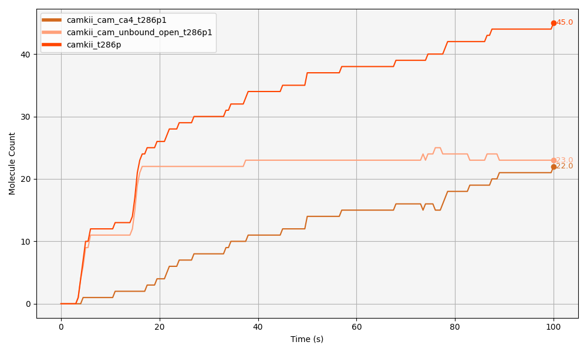

# Results of _In Silico_ Wild-Type and Mutant Models {#sec-results}

Three principal model versions of the CaMKII/NMDAR model have been developed. The first is a wild-type (WT) model, as described in @sec-model-description. In addition, two mutant (MT) models were constructed: one in which CaMKII is unable to phosphrylate at T286, and another in which CaMKII cannot bind to NMDARs. These mutations were implemented by setting the reaction rates corresponding to CaMKII autophosphorylation and CaMKII–NMDAR binding, respectively, to zero.

##  model

This section presents a summary of the results obtained from the WT model. In the WT simulation, the final total number of CaMKII_open molecules reaches a mean of approximately 108 molecules at 100 seconds. The shaded area surrounding the mean trajectory in the graph represents the standard deviation (SD), indicating the degree of variability across different simulation runs.

Figure 7.2 provides an overview of the key molecular interactions and states observed in the  WT CaMKII/NMDAR model during the simulation. Each subpanel (a–d) captures specific aspects of the molecular dynamics, focusing particularly on the interplay between CaMKII opening, T286 phosphorylation, CaM binding, and NMDAR binding.

Figure 7.2a shows the evolution of the open conformation of CaMKII over time. The brown line represents the total number of CaMKII_open subunits, which steadily increases as the simulation progresses. Two main factors contribute to the stabilization of CaMKII in the open state: (i) CaM binding (light blue line, camkii_cam_unbound_open) and (ii) NMDAR binding (dark blue line, nmdar_camkii_complex). Notably, NMDAR binding can maintain CaMKII in the open conformation even in the absence of CaM binding (Fig 7.2c). Figure 7.2b focuses on T286 phosphorylation dynamics of CaMKII. The orange line (camkii_t286p) shows the total number of CaMKII subunits phosphorylated at T286, while the pink line (camkii_t286p1_bound_nmdar) represents the subset of T286-phosphorylated subunits that are also bound to NMDARs. A large fraction of phosphorylated subunits are found associated with NMDARs, indicating that NMDAR binding promotes or sustains T286 phosphorylation. Importantly, this phosphorylation happens largely independently of CaM, as further illustrated in panels (c) and (d).

Figure 7.2c dissects the T286-phosphorylated CaMKII subunits that are bound to NMDARs into CaM-bound and CaM-unbound populations. Here, the pink line represents all T286-phosphorylated CaMKII subunits bound to NMDARs, while the orange line shows the subset that are CaM-free  (camkii_cam_unbound_t286p1_bound_nmdar). It is clear that the majority of the T286-phosphorylated CaMKII subunits bound to NMDARs are unbound from CaM, emphasizing that CaMKII can maintain phosphorylation at T286 even after CaM dissociates. This further supports the idea that NMDAR binding alone is sufficient to stabilize the active, open, phosphorylated state in this model. Figure 7.2d provides a more detailed look at T286 phosphorylation in relation to CaM binding across the whole CaMKII population. The data shows that roughly equal numbers of CaMKII subunits are phosphorylated at T286 whether they are CaM-bound or CaM-unbound. This demonstrates that although CaM binding facilitates CaMKII opening and activation, T286 phosphorylation does not require continuous CaM binding once CaMKII is locked in its open, phosphorylated conformation.

To further dissect the molecular events underlying these dynamics, the following sections will explore a representative simulation run in detail, focusing on the specific behaviours of CaMKII subunits in relation to NMDAR and CaM binding, and T286 phosphorylation.

::: {.landscape}

{#fig-t286p-means fig-scap="abcd"}

:::

### Calcium release and initial CaM saturation
In the WT model (described in detail in @sec-model-description), a release of 1000 calcium ions occurs within a dendritic spine volume of 0.50588 $\mu\text{m}^3$. This calcium subsequently binds to CaM, which can bind up to four calcium ions. Full saturation of CaM is required for subsequent binding to CaMKII, resulting in the formation of the CaMKII–CaM complex (CaMKII_CaM_Ca4).

This progression is illustrated in [@fig-calcium-binding], where the gradual formation of partially and fully calcium-bound CaM species is shown. Although calcium itself is not displayed (due to its relatively high concentration distorting the plot scale), the stepwise increase in CaM species bound to one, two, three, and four calcium ions is clearly visible. The appearance of CaMKII bound to fully saturated CaM (camkii_cam_ca4) further confirms the expected dynamics. as per the set reaction rates and established literature, CaM fully bound to four calcium ions is immediately available for binding to CaMKII, whereas CaM bound to fewer calcium ions is less readily available for this interaction.

The simulation reveals a rapid decrease in the concentration of free CaM, which stabilises at approximately half of its initial value, suggesting that roughly half of the CaM molecules remain unbound to calcium. Upon further investigation, this suggests that calcium is acting as a saturating factor. Given that each CaM molecule can bind up to four calcium ions, the 290 CaM molecules would require at least 1200 calcium ions (290 × 4 $\approx$ 1200) for full saturation. However, the model uses 1000 calcium ions, which is slightly below this threshold. It is also worth noting that calcium ions are continuously binding to and dissociating from CaM as part of the ongoing reactions, so as some calcium may dissociate from one species, it might then associate to another, allowing for dynamic and emergent molecule behaviours. Even if the calcium concentration were increased (the difference between 1000 and 1200 calcium ions would be relatively small, from 3.282 μM to 3.938 μM, respectively), we would expect an increase in the number of CaM molecules bound to four calcium ions, but the change might not be substantial. 

{#fig-calcium-binding fig-pos='H' fig-scap="CaM binding calcium"}

### CaM stabilises CaMKII in the open conformation, but is not required for CaMKII/NMDAR binding
Next, we examine CaM–CaMKII binding (@fig-cam-camkii-binding), focusing on how CaMKII's open conformation of subunits stabilises over time. Out of the 720 CaMKII subunits released (not shown), a total of 104 molecules remain in the open conformation (camkii_open), at 100 seconds. Camkii_open represent the total population of CaMKII subunits that are structurally in their open state. To determine how many of these open subunits are simultaneously bound to CaM, we refer to the pink trace in @fig-cam-camkii-binding, which indicates that 79 subunits are CaM-bound by the end of the simulation. This shows that approximately 75% of the open CaMKII subunits are being stabilised in this state through CaM binding up until the end of the simulation. 

In contrast, the population of open CaMKII subunits that are not bound to CaM reaches equilibrium just before the 20-second mark, maintaining a steady count of just above 20 molecules until the end of the simulation. This accounts for the remaining 25% of the open CaMKII pool. These observations indicate that the majority of open CaMKII subunits are stabilised in their active conformation via CaM binding, while a smaller proportion is maintained in the open state by alternative mechanisms.

In the model at hand, CaMKII is defined as dynamically transitioning between open and closed conformations, and unless stabilised in the open state —either through CaM binding, T286 phosphorylation, or NMDAR association— it will revert to the closed state (see @fig-tbl-1). So we can see in @fig-cam-camkii-binding that the majority of CaMKII open is stabilised by CaM, however, there is another mechanism that is keeping CaMKII open. This other mechanism is in direct relation with NMDAR interaction as we will explore next. 

By examining @fig-camkii-opening-nmdar, we observe that the levels of CaMKII binding to NMDARs (dark blue line: nmdar_camkii_complex) closely follow the same pattern as CaM unbinding from CaMKII (medium blue: camkii_cam_unbound_open). In other words, as CaMKII associates with NMDARs, this interaction maintains CaMKII in an open state, without the need for CaM binding to CaMKII. 

Interestingly, the proportion of CaMKII free from CaM that are still in their open conformation (medium blue: camkii_cam_unbound_open, @fig-camkii-opening-nmdar) fluctuates up and down frequently, which comes from CaMKII opening and closing (as CaM is not bound yet). 

Initially, the level of CaMKII free from CaM that are still in their open conformation (camkii_cam_unbound_open) fluctuates and exceeds the amount of CaMKII bound to NMDARs (nmdar_camkii_complex). This indicates that while a pool of open CaMKII is available, not all of it is bound to NMDARs at once. Over time, as CaMKII binding to NMDARs progresses and the system approaches a steady state, newly opened CaMKII subunits are quickly captured by available NMDAR binding sites. Consequently, the amount of free, open CaMKII stabilizes at a level consistently lower than the amount of NMDAR-bound CaMKII, indicating that binding to NMDARs efficiently sequesters and stabilizes open CaMKII in the later phase.

Moreover, in @fig-camkii-opening-nmdar, we observe a three-step, ladder-like progression of CaMKII binding to NMDARs. Each step corresponds to an increase in the number of CaMKII subunits bound: first reaching approximately 12 subunits, then 24, and finally 30. This pattern suggests that entire CaMKII holoenzymes (each containing 12 subunits) sequentially bind to NMDARs.

Initially, one holoenzyme binds rapidly, with its subunits quickly associating with available NMDARs. Once 12 subunits are bound, a second holoenzyme begins binding. However, this process is slower, likely because after the first 12 subunits are bound, there are fewer free NMDARs left. Now, the second holoenzyme has fewer choices, and it may need to "search" or "diffuse" around more to find free receptors. Finally, after the second holoenzyme binds (up to 24 subunits), a third holoenzyme binds partially, occupying the remaining 6 NMDARs. By the time the third holoenzyme tries to bind, only 6 NMDARs are free — not enough for all 12 subunits. The progressive slowing reflects decreasing availability of free NMDARs for binding. The implications of these findings are discussed in the REFERENCE-SECTION; however, this particular mode of CaMKII binding to NMDARs may be an artifact of the model. Although not necessarily invalid, this aspect warrants further scrutiny and should be revisited in future research, as explored further in the discussion section below.

In summary, the majority (75%) of CaMKII subunits in the open conformation are stabilized by binding to CaM. However, while  CaM helps stabilize CaMKII in the open state, the binding of CaMKII to NMDARs is not dependent on CaM. As CaMKII binds to NMDARs, it maintains its open conformation even without CaM binding, indicating that the interaction between CaMKII and NMDARs can stabilize the open state of CaMKII independently of CaM. 

::: {#fig-camkii-open layout-ncol=1 fig-pos='H' fig-scap="Stabilisation of CaMKII in the Open Conformation" width="70%"}

{#fig-cam-camkii-binding}

{#fig-camkii-opening-nmdar}

Stabilisation of CaMKII in the Open Conformation. _For reproducibility, this figure was obtained from plotting data from "run_2025-04-03_08-45-21_seed_2."_

:::

### CaMKII subunits remain open and autophosphorylate at T286 upon NMDAR binding, regardless of CaM binding
Next we look at total number of CaMKII subunits phosphorylated at T286. CaMKII_T286P reflects the full amount of T286-phosphorylated CaMKII, irrespective of any other concurrent molecular states. All CaMKII subunits categorised as camkii_t286p are necessarily in the open conformation. Therefore, camkii_t286p represents a subset of the camkii_open population [@fig-subsets-of-open-t286p1_p0]. This is consistent with both the model's coding and biological evidence, as phosphorylation at T286 locks CaMKII in an autonomously active, open conformation by preventing the regulatory segment from re-binding to the catalytic domain, which physically prevents closing of the subunit.

Out of the 104 CaMKII subunits that are open at the end of the simulation, 45 are found to be phosphorylated at T286 [@fig-subsets-of-open-t286p1_p0], and the rest (104 - 45 = 59) are therefore not phosphorylated at this site. This indicates that approximately half of the open CaMKII subunits are in a T286-phosphorylated state. 

Of the 45 T286-phosphorylated CaMKII subunits, a subset of 25 are found to be bound to NMDARs (pink line: camkii_t286p1_bound_nmdar as shown in @fig-camkii-t286p-nmdar-b). The difference between these two molecules, corresponds to the number of CaMKII molecules that are T286-phosphorylated but not associated with NMDARs. This is, out of all the CaMKII subunits that are phosphorylated at T286, about half can be found bound to NMDARs, and the other half is not. Figure @fig-subsets_nmdar-t268p further demonstrates that the majority of CaMKII subunits bound to NMDARs and phosphorylated at T286 are unbound from CaM. This complements observations in @fig-camkii-t286p-nmdar-b, where 25 CaMKII subunits are both T286-phosphorylated and bound to NMDARs, of which 23 are CaM-free and only 2 remain CaM-bound by the end of the simulation.

Further, within the population of T286-phosphorylated CaMKII that is also bound to NMDARs (pink line: camkii_t286p1_bound_nmdar), only a very small number of subunits remain bound to CaM [@fig-subsets_nmdar-t268p]. Thus, the majority of CaMKII subunits that are bound in a NMDAR/CaMKII complex are both phosphorylated at T286 and free from CaM (which is consistent with literature, as further discussed in REFERENCE-SECTION). This is, once CaMKII is bound to the NMDARs, the holoenzyme subunits can remain open, and autophosphorylate even in the absence of CaM. 

{#fig-subsets-of-open-t286p1_p0 fig-pos='H' fig-scap="CaMKII open and T286 phosphorylated"}

{#fig-camkii-t286p-nmdar-b fig-pos='H' fig-scap="CaMKII T286 phosphorylated and bound to CaM"}

{#fig-subsets_nmdar-t268p fig-pos='H' fig-scap="CaMKII T286 phosphorylated and bound to CaM"}

### NMDAR binding is the primary driver of T286 phosphorylation
As explained in @sec-cam-binding-and-t286-p, we use a 'conformational selection' approach to modelling CaMKII activation, where CaMKII can exist in both open and closed states independently, and CaM selectively binds to and stabilizes the open conformation, without _inducing_ a conformational change. In order to understand how CaM is interacting with CaMKII T286 phosphorylation, we look at @fig-subsets-of-camkii-t286p-cam-binding. Here we can see that among all CaMKII subunits phosphorylated at T286, approximately half (23 molecules) are also bound to CaM, represented by the peach-coloured trace _"camkii_cam_ca4_t286p1"_, while the remaining half (22 molecules) are unbound from CaM (brown-coloured trace: _"camkii_cam_unbound_open_t286p1"_). 

This indicates that, although CaM binding co-occurs with T286 phosphorylation, T286 is not necessarily more likely when subunits are bound to CaM. In fact, subunits that are both CaM-bound and T286-phosphorylated emerge more slowly during the simulation [@fig-subsets-of-camkii-t286p-cam-binding], suggesting that CaM binding is not the main event leading to the increase of initial CaMKII T286 phosphorylation, but as we will see next, NMDAR binding is (by keeping CaMKII subunits in their open conformation and allowing subsequent T286 autophosphorylation).

T286-phosphorylated CaMKII which is free from CaM (peach-coloured line in @fig-xsubsets_nmdar-t268p) corresponds in timing with the formation of the CaMKII/NMDAR complex [@fig-subsets_nmdar-t268p]. This suggests that, once CaMKII binds to NMDARs and its subunits are held in the open conformation, autophosphorylation at T286 is further facilitated in the CaMKII subunits that are part of the CaMKII/NMDAR complex. 

Interestingly, a slight increase in the population of CaMKII free from CaM and T286 phosphorylayed is observed around 80 seconds. This rise suggests that subunits of holoenzymes locked into the CaMKII/NMDAR complex undergo further autophosphorylation of neighbouring subunits, resulting in a momentary increase in CaMKII subunits that are free from CaM and phosphorylated at T286.

{#fig-subsets-of-camkii-t286p-cam-binding}

{#fig-xsubsets_nmdar-t268p}

{#fig-xsubsets_nmdar-t268p0}

### NMDAR binding also promotes CaMKII autophosphorylation at T306 site
Phosphorylation at the T306 site is known to occur at a slower rate than phosphorylation at T286 [@otmakhov2015Fast; @chang2017CaMKII], and this is reflected in the model outputs. A total of 25 CaMKII subunits become phosphorylated at T306 over the course of the simulation (marroon trace: camkii_t306p in @fig-t306p), of which 21 are bound to the NMDAR (golden trace:camkii_cam_unbound_t306p1_bound_nmdar in @fig-t306p) —indicating that approximately 84% of T306-phosphorylated subunits are part of NMDAR complexes. 

Moreover, the accumulation of doubly phosphorylated subunits (T286P and T306P; here referred to as CaMKII_PP, hot pink trace in @fig-t306p) appears to track closely with the rate of T306 phosphorylation. This indicates that T306 phosphorylation typically follows T286 phosphorylation, particularly during the earlier stages of the simulation. This behaviour is consistent with both the modelled mechanisms and findings reported in the literature [REFERENCE].

{#fig-t306p fig-pos="H"} 

Interestingly, after around 60 seconds, subunits that are solely phosphorylayed at T306 continue to increase, whilst CaMKII_PP does not (@fig-t306p). This suggests that, at later stages in the simulation, T306 phosphorylation can occur and persist independently of T286 phosphorylation. Extending the simulation time may offer further insights into this dynamic, as it could support the biological hypothesis that initial T286 phosphorylation enables subsequent T306 phosphorylation, but that T306P can then be maintained even in the absence of T286P [REFERENCE].

Furthermore, T306 phosphorylation follows NMDAR binding dynamics closely. As shown in @fig-t306p-nmdar-binding, CaMKII subunits initially bind to NMDARs in an unphosphorylated T306 state (slate-green: camkii_t306p0_bound_nmdar in @fig-t306p-nmdar-binding). Once the CaMKII–NMDAR complex reaches equilibrium, levels of T306 phosphorylation increase correspondingly, as unphosphorylated T306 decreases. 

{#fig-t306p-nmdar-binding fig-pos="H"} 

In the final phase of CaMKII binding to NMDARs, after approximately 40 seconds —when all NMDARs are saturated, T306 phosphorylation continues to rise. This is likely supported by the concurrent increase in T286 phosphorylation, and by a decrease in CaM binding to CaMKII subunits already bound to NMDARs. That is, by 40s, a greater proportion of CaMKII subunits are free from CaM (as seen in @fig-subsets-of-camkii-t286p-cam-binding). This aligns with expectations, as CaM binding and T306 phosphorylation are mutually exclusive processes —CaM must be unbound for T306 phosphorylation to occur. Therefore, as the model shows a decrease in CaM binding to CaMKII subunits that are already part of the CaMKII–NMDAR complex, the opportunity for T306 phosphorylation increases. In other words, the less CaM is bound to CaMKII subunits, the more likely it is that T306 can become phosphorylated, and the less likely CaM is to bind. 

@fig-t306p-nmdar-binding shows three distinct peaks, each representing CaMKII subunits that are in the "p00" state — meaning they are not phosphorylated at either T286 or T306. This pattern highlights three important insights. First, CaMKII binds to NMDARs before any phosphorylation has occurred. Second, although phosphorylation is not required for binding, once CaMKII is incorporated into an NMDAR complex, autophosphorylation becomes more likely. Third, phosphorylation at T306 follows phosphorylation at T286, following a sequential phosphorylation mechanism as expected.

These findings show that the formation of CaMKII-NMDAR complexes does not depend on prior phosphorylation at T286. However, once T286 phosphorylation occurs, it can initiate a cascade of further autophosphorylation events, including at T306, within the same NMDAR/CaMKII complex. Previous studies have shown that CaMKII does not need to be phosphorylated at T286 in order to bind to NMDARs or to perform its catalytic functions. That said, phosphorylation at T286 can modulate or enhance both the binding affinity and the enzymatic activity of CaMKII, making it an important regulatory step rather than an absolute requirement.

## T286 and CaMKII/NMDAR binding MT models

The T286 MT model is simialr biologically to the CaMKII T286A MT, in which the critical autophosphorylation site threonine 286 is substituted with alanine, preventing phosphorylation at this site. This mutation has been extensively characterised in both _in vitro_ biochemical assays and _in vivo_ using mice that were genetically modified. T286A mutation has been shown to impair LTP and spatial learning in rodents. he computational implementation allows investigation into how the loss of T286 phosphorylation alters CaMKII dynamics and downstream NMDAR interactions under different stimulation conditions [REFERENCES]. In the T286 MT model, this mutation is represented by setting reaction rule #8 to zero (@fig-tbl-1), so phosphorylation can not happen.

The NMDAR/CaMKII binding MT model simulates a mutation that disrupts the interaction between CaMKII and the GluN2B subunit of NMDARs. This disruption can be achieved through mutations in either CaMKII or GluN2B, preventing their binding without necessarily altering other functions such as kinase activity [REFERENCES]. A well-characterized example is the CaMKII I205K mutation, where isoleucine is replaced by lysine. This substitution significantly impairs binding to GluN2B while leaving kinase activity intact [REFERENCE]. Experimental evidence shows that this mutation also reduces CaMKII accumulation at synapses following LTP induction [REFERENCE]. CHECK - this  would be good to see in vizz output and future models. In the CaMKII/NMDAR MT model, this binding disruption is represented by setting reaction rule #12 to zero (@fig-tbl-1), so NMDAR and CaMKII binding can not proceed.

The following analysis compares  WT simulations with those of the two MT models. The total number of simulation runs for each group is as follows: WT (N = 9), T286 MT (N = 9), and CaMKII/NMDAR MT (N = 4). t-test and one-way anovas were performed with prior testing for normality of data sets using whitely test. 

Simulations were conducted under identical parameters across all conditions (see @fig-molecule-concentrations for initial molecule release and @fig-tbl-1 for reaction rates), except for two CaMKII/NMDAR MT runs, as I explain below, which were part of preliminary tests involving a different CaMKII release state. Aside from this, the only intended differences between groups were the modifications to the relevant reaction rules described above.

The reduced number of simulations for the CaMKII/NMDAR MT model resulted from a human error during file execution, which will be explored in greater detail in the discussion section below. Due to this error, only four usable simulation runs were available for this model. It is important to note that, while all other simulation groups released CaMKII in its open state, the CaMKII/NMDAR MT group includes two runs with CaMKII released in the closed state and two with CaMKII released in the open state. These files, originally generated during preliminary testing (data not shown), were the only available usable runs for this condition due to the aforementioned error. As no substantial differences in simulation outcomes were observed between the two release states, all four runs were retained in the analysis. This detail is provided here for transparency.

### NMDAR binding stabilizes CaMKII open conformation more readily than T286 phosphorylation
Having established the simulation conditions for each model, we now present quantitative comparisons between WT and MT simulations across key molecular outputs. A primary focus of this analysis is the extent of CaMKII opening, as this conformational state is influenced by both T286 phosphorylation and binding to NMDARs. Given that both of these interactions promote and stabilise the open conformation of CaMKII, it was expected that disrupting either mechanism, through mutation at T286 or impairment of NMDAR binding, would lead to a reduction in CaMKII opening.

@fig-camkii_open_anova displays the results of an ANOVA, with an F-statistic of 36.327, indicating a substantial difference between the group means relative to the variation within each group. Further, the associated p-value of $3.219 \times 10^{-7}$ indicates a very low probability that the observed differences between the groups are due to random chance.

Both mutations significantly decreased CaMKII opening relative to the WT control. The reduction observed in the T286_MT group was modest, with a mean of 100 compared to 109 in the WT group, but statistically significant (p < 0.05), supporting the role of T286 phosphorylation in stabilising the open conformation of CaMKII. These results were expected, as abolishing T286 phosphorylation means decreasing the chances of CaMKII subunits being kept in their open conformation via this mechanism. 

The NMDAR_CaMKII_MT group exhibited a much more pronounced and highly significant reduction in CaMKII opening compared to the WT group (p < 0.0001). As expected, reduced binding to NMDARs corresponds to a decreased likelihood of CaMKII remaining in its open conformation. Interestingly, CaMKII opening in the NMDAR_CaMKII_MT group was not only significantly lower than in the WT group, but also lower than in the T286_MT group (p < 0.0001). These findings reinforce the idea that NMDAR binding plays a central role in maintaining CaMKII in its open state in our simulations. While T286 phosphorylation is also important, it is the disruption of CaMKII/NMDAR binding that most strongly impacts CaMKII opening levels.

![Both the T286 MT (T286_MT) and the NMDAR/CaMKII binding MT (NMDAR_CaMKII_MT) exhibit significantly lower levels of CaMKII opening compared to WT, with the largest reduction observed in the NMDAR_CaMKII_MT condition. Final molecule counts for camkii_open are shown for each simulation run (dots), with group-level distributions represented as boxplots. Solid lines represent medians, and dashed lines represent means. Statistical comparisons were performed using one-way ANOVA followed by Tukey’s HSD post hoc test. Asterisks indicate levels of statistical significance from Tukey’s HSD post hoc test: p < 0.05 (*), p < 0.001 (**), and p < 0.0001 (****). ANOVA F-statistic between groups = 36.327, and $p = 3.219 \times 10^{-7}$.](40-results-figures\statistics\camkii_open_anova.png){#fig-camkii_open_anova fig-scap="Both the T286 MT and the NMDAR/CaMKII binding MT exhibit significantly lower levels of CaMKII opening compared to WT" fig-pos="H"}

### Autophosphorylation at T286 promotes CaM binding but NMDAR binding does not
Next, I aimed to examine whether CaM binding to CaMKII was affected across the three models. Given the expected reduction in CaMKII opening, I expected that this decrease might also result in reduced CaM binding in both MT models. Specifically, I wanted to explore how CaM binding is related to both T286 phosphorylation and NMDAR/CaMKII binding.

As shown in @fig-CaMKII_CaM_Ca4_anova, total CaMKII bound to CaM (camkii_cam_ca4) was significantly reduced only in the T286 MT. The F-value of 4.668 indicates that the variance _between_ groups (i.e., how much the CaM binding values differ between the WT, T286_MT, and NMDAR/CaMKII_MT) is considerably larger than the variance _within_ groups (i.e., how much individual data points vary within each group). In other words, the groups are not just randomly different; the differences between the groups are meaningful and consistent. The significant reduction in CaM binding in the T286 MT (p < 0.05), and the lack of difference in the NMDAR/CaMKII MT compared to WT, suggests that T286 phosphorylation influences CaM binding to CaMKII by keeping it in the open state. On the other hand, NMDAR binding does not appear to have a similar effect.

These findings were initially unexpected, as I had anticipated that reduced CaMKII opening in both MTs might affect CaM binding in both models. However, the results are actually consistent with the underlying mechanisms that we had previously obeserved. In the WT model, CaM binding and NMDAR binding to CaMKII subunits appeared to be independent processes. Notably, the majority of CaMKII bound to NMDARs did not interact with CaM. This independence between NMDAR binding and CaM binding to CaMKII helps explain why the NMDAR/CaMKII MT, which disrupts NMDAR binding, does not significantly affect CaM binding. Since NMDAR binding and CaM binding to CaMKII are independent events, disrupting NMDAR binding does not impact the ability of CaMKII to bind to or release CaM. In contrast, the T286 mutation does lead to a reduction in CaM binding, highlighting the specific role of T286 phosphorylation in regulating CaM binding.

![CaM binding to CaMKII is significantly reduced only with the loss of T286 phosphorylation. Final molecule counts for camkii_cam_ca4 are shown for each simulation run (dots), with group-level distributions represented as boxplots. Solid lines represent medians, and dashed lines represent means. The T286 MT (T286_MT) shows a significant reduction in CaM-bound CaMKII compared to WT (p < 0.05), whereas no significant difference ('ns') is observed between WT and the NMDAR/CaMKII MT (NMDAR_CaMKII_MT), or between the two MT groups. Statistical analysis was performed using one-way ANOVA (F = 4.668, p = 0.022), followed by Tukey’s HSD post hoc test.](40-results-figures\statistics\CaMKII_CaM_Ca4_anova.png){#fig-CaMKII_CaM_Ca4_anova fig-scap="CaM binding to CaMKII is significantly reduced only with the loss of T286 phosphorylation" fig-pos="H"}

#### NMDAR binding is the main stabiliser of CaMKII's open state
To further explore how NMDARs and T286 phosphorylation affect CaMKII opening, I looked at the amount of CaMKII subunits that remain free from CaM and are kept in their open state (denoted as CaMKII–CaM_unbound_open, @fig-camkii_cam_unbound_open). I observed a significant decrease in this molecule count in the NMDAR/CaMKII binding MT. As discussed previously, in the WT model, NMDARs play an active role in stabilizing CaMKII in its open state, even in the absence of CaM. This means that, in this model, NMDARs are crucial for maintaining CaMKII in its open form, free from calmodulin. When this stabilizing mechanism is disrupted in the NMDAR/CaMKII mutant, less CaMKII remains in the open state without CaM, because the NMDAR binding, which normally helps keep the CaMKII subunits open and CaM-free, is no longer functioning. As a result, there is a reduction in the amount of CaMKII remaining in its open state. Conversely, in the T286 mutant model, the ability of NMDARs to keep CaMKII in its open, CaM-free state is still intact, which explains why this aspect remains unaffected in this model. 

![NMDAR binding is crucial for maintaining CaMKII in its open, CaM-free state (camkii_cam_unbound_open). Boxplot shows final molecule counts for camkii_cam_unbound_open across  WT, T286 phosphorylation mutant (T286_MT), and NMDAR/CaMKII binding mutant (NMDAR_CaMKII_MT) models. Individual simulation runs are represented as dots. Boxes represent the interquartile range, solid lines show medians, and dashed lines show group means. A one-way ANOVA revealed a significant group effect (F = 236.180, $p = 3.80 \times 10^{-14}$), with post hoc Tukey’s HSD tests indicating significantly fewer CaMKII molecules in this state in the NMDAR/CaMKII mutant compared to both WT and T286_MT (**p < 0.001). No significant difference was observed between WT and T286_MT.](40-results-figures\statistics\camkii_cam_unbound_open.png){#fig-camkii_cam_unbound_open fig-scap="NMDAR binding is crucial for maintaining CaMKII in its open, CaM-free state" fig-pos="H"}

#### NMDAR binding stabilizes CaMKII open conformation and drives T286 and T306 phosphorylation
Since NMDARs play an essential role in keeping CaMKII subunits open and free from CaM (as shown by the CaMKII_cam_unbound_open data), this opens up the question of whether T286 phosphorylation, which is a key event for CaMKII activation, is also influenced by NMDAR signalling. In the WT model, we observed that CaMKII subunits bind to NMDARs in an unphosphorylated state, and T286 phosphorylation is subsequently stabilized once these subunits associate with NMDARs, even in the absence of CaM. What is more, NMDAR binding was identified as the key event leading to T286 phosphorylation, as it helps maintain CaMKII in its open conformation, thus enabling T286 autophosphorylation. Consequently, in the NMDAR/CaMKII binding mutant, where NMDAR-CaMKII interaction is disrupted, we expect T286 phosphorylation to be significantly reduced due to the loss of this stabilization mechanism. As expected, in the NMDAR/CaMKII binding MT, we observed a significant reduction in T286 phosphorylation, confirming the importance of NMDAR-CaMKII binding in T286 autophosphorylation (@fig-camkii_t286p_nmdarMT).

Further, as previously observed in the WT model, phosphorylation at T306 was promoted following T286 phosphorylation in CaMKII subunits already bound to NMDARs, suggesting that NMDAR association is a key upstream event driving T306 phosphorylation. Looking at @fig-t306p_anova, we can see that T306 phosphorylation is significantly reduced in the NMDAR/CaMKII mutant model compared to both the WT and the T286 mutant, indicating that indeed NMDAR binding is important for T306 phosphorylation. Interestingly, the T286 mutant does not show a significant reduction in T306 phosphorylation relative to WT. Given that in the WT model T306 phosphorylation typically follows T286 phosphorylation, one might expect the T286 mutant to also exhibit reduced T306 levels. However, these results suggest that T306 phosphorylation can still occur independently of prior T286 phosphorylation, highlighting the dominant role of NMDAR binding in promoting the T306 phosphorylation event. The biological significance of these results is further explored in the discussion section below. 

![NMDAR binding is critical for promoting T286 phosphorylation of CaMKII. Individual simulation runs are shown as dots; boxes indicate the interquartile range, with solid lines denoting the median and dashed lines the mean. A two-tailed t-test revealed a highly significant reduction in T286-phosphorylated CaMKII in the NMDAR mutant (t = 7.73, p < 0.0001, ***), consistent with the proposed mechanism where NMDAR binding stabilizes CaMKII in an open conformation that favours autophosphorylation at T286.](40-results-figures\statistics\camkii_t286p_nmdarMT.png){#fig-camkii_t286p_nmdarMT fig-scap="NMDAR binding is critical for promoting T286 phosphorylation of CaMKII" fig-pos="H"}

![NMDAR binding is critical for T306 phosphorylation of CaMKII, while T286 phosphorylation has no significant effect. Boxplot showing final camkii_t306p molecule counts for WT, T286 mutant (T286_MT), and NMDAR/CaMKII binding mutant (NMDAR_CaMKII_MT) models. Individual simulation runs are shown as dots; boxes indicate the interquartile range, with solid lines denoting the median and dashed lines the mean.  A one-way ANOVA revealed a significant overall effect (F = 77.035, p = 7.674e–10), with Tukey’s HSD post hoc test confirming significantly reduced T306 phosphorylation in the NMDAR_CaMKII_MT compared to both WT and T286_MT (***), while the difference between WT and T286_MT was not statistically significant (ns). This suggests that NMDAR-CaMKII interactions, but not T286 phosphorylation status, are critical for enabling T306 phosphorylation.](40-results-figures\statistics\t306p_anova.png){#fig-t306p_anova fig-scap="NMDAR binding is critical for promoting T286 phosphorylation of CaMKII" fig-pos="H"}

#### T286 phosphorylation does not influence the binding of CaMKII to NMDARs
As shown in @fig-nmdar_MTvsWT, both the T286 mutant model and the wild-type (WT) eventually plateau at 30 bound CaMKII/NMDAR complexes. This indicates that, despite the absence of T286 phosphorylation in the mutant model, the number of CaMKII subunits bound to NMDARs reaches the same final value as in the WT. This observation further strengthens the idea that NMDAR binding plays a critical role in promoting T286 phosphorylation of CaMKII, while the phosphorylation state of T286 does not influence the ability of CaMKII to bind to NMDARs. Furthermore, as observed in thw WT runs above (refer back to @fig-t306p-nmdar-binding), CaMKII can bind to NMDARs in an unphosphorylated state, providing additional support for the conclusion that, in the model used here, NMDAR binding is a key driver of T286 phosphorylation but not the other way around. 

{#fig-nmdar_MTvsWT fig-scap="NMDAR binding is critical for promoting T286 phosphorylation of CaMKII" fig-pos="H"}

## Discussion of results and future directions

An overarching aim of this study was to investigate how the functional states of CaMKII—particularly through its phosphorylation and binding to NMDARs—affect the stability of the CaMKII/NMDAR complex and its role in synaptic signalling. To address this, I examined how the interaction between CaMKII and NMDARs influences CaMKII activity and function, using an in silico mutation model where CaMKII–NMDAR binding is disrupted. Likewise, I explored how CaMKII phosphorylation impacts its binding to NMDARs by investigating a model in which CaMKII cannot be phosphorylated at the T286 site. The following discussion will interpret the results from these _in silico_ mutation models, assess their relevance to the original research questions, and highlight how these findings contribute to a deeper understanding of the molecular processes underlying synaptic plasticity.

Previous studies have shown that transient CaMKII activity induces a reversible, CaM-dependent binding of GluN2B to the substrate-binding site within CaMKII's catalytic domain. And that prolonged CaMKII activation leads to a persistent interaction between GluN2B and the T286 phospho-site on CaMKII, which locks CaMKII in an active conformation [REFERENCES]. Moreover, studies have shown that even if CaM dissociates, CaMKII can remain active and have autonomous activity without CaM [REFERENEC]. 

The results observed in this model are generally in line with findings reported in the literature; the results show that CaMKII can maintain its open, active conformation through interactions with NMDARs, even in the absence of CaM. Notably, in the NMDAR/CaMKII MT model, there is a significant reduction in the proportion of CaMKII that remains in the open, active state when compared with both the WT and T286A MT models. This finding aligns with the literature proposal that NMDAR binding plays a critical role in stabilising CaMKII in its active conformation [REFERENCE].

Moreover, the NMDAR/CaMKII mutant model shows a substantial decrease in the amount of CaMKII in its open, active form when compared to both the WT and T286 mutant models. This suggests that NMDAR binding is integral to maintaining CaMKII in its open conformation. While the T286 mutation also leads to a reduction in CaMKII openness, consistent with the established role of autophosphorylation at T286 in promoting autonomous activity [REFERENCE], the effect is notably less severe than that observed in the NMDAR-binding mutant. This aligns with prior findings indicating that CaMKII binding to GluN2B induces a conformational change that sustains kinase activity even in the absence of T286 phosphorylation.

camkii open is also reduced by abolishing t286p, but to a lesser extent than in the nmdar/camkii mutant. studies have shown that CaMKII bound to GluN2B induces a conformational change that allows the enzyme to maintain autonomous activity, even when CaMKII is dephosphorylated at Thr286. the significant decrease we see in fig-6.16 for camkii open state for the nmdar/camkii mutant but not as much for the t286 mutant align with this right? cos even when there is no phosphorylation at t286 (in the t286p mutant), camkii opening is not as affected as when nmdar/camkii binding is abolished. Thus, the data support a model in which NMDAR binding serves as the primary mechanism for maintaining CaMKII in its open state, while T286 phosphorylation provides a secondary stabilising influence. The more substantial loss of open CaMKII in the NMDAR/CaMKII mutant, compared to the T286 mutant, reinforces the idea that membrane anchoring to NMDARs is functionally dominant in regulating CaMKII conformational dynamics under these conditions. However, the specific mechanism by which CaMKII binds to NMDARs in this model may not fully align with the established structural characteristics of CaMKII. While the results themselves are valid, the binding mode inferred from the model may not align with biologically realistic configurations of the CaMKII holoenzyme.

In the model at hand, it appears that an entire CaMKII holoenzyme initially binds to a single NMDAR, with subsequent subunits from the same holoenzyme engaging with adjacent NMDARs. This effectively results in one holoenzyme binding to and "trapping" up to 12 NMDARs simultaneously, where we observed a stepwise increase in CaMKII binding across three phases, indicating that individual holoenzymes sequentially bind to available NMDARs (@fig-camkii-opening-nmdar). Given the structure and known conformations of the CaMKII holoenzyme, such multivalent binding across multiple receptors seems unlikely. It is more plausible that only one or possibly two subunits from a single holoenzyme engage with NMDARs, due to spatial limitations imposed by the protein’s quaternary structure [REFERENCE].

This mode of binding arises from the way reaction rules are encoded in the model, as it does not prevent multiple CaMKII subunits within a holoenzyme from binding to NMDARs simultaneously. A potential improvement for future work would be to introduce a rule where only one CaMKII subunit per holoenzyme can bind to an NMDAR, which would increase the likelihood of different CaMKII holoenzymes interacting with NMDARs. By limiting the binding to one subunit per holoenzyme, there would be more CaMKII holoenzymes available in the vicinity of NMDARs, rather than a single holoenzyme trying to bind to multiple receptors at once. This would allow for a more distributed interaction where multiple holoenzymes could engage with a set of receptors, rather than a single holoenzyme "trapping" all the receptors.

An intriguing observation in the results of this model is the emergent behaviour of CaM trapping. CaM trapping refers to the phenomenon whereby phosphorylation of CaMKII at T286 increases its affinity for CaM, preventing the dissociation of the complex [REFERENCE]. This effect has not been explicitly encoded into the current model, as we have not specified an increased affinity for CaM upon T286 phosphorylation. Despite this, we observe that autophosphorylation at T286 does indeed promote CaM binding. Interestingly, when T286 phosphorylation is abolished, the binding of CaM is reduced. In contrast, the NMDAR/CaMKII mutant model does not show a decrease in CaM binding, likely because this mutant still retains T286 phosphorylation, which is what seems to be important for CaM binding. In summary, although the model does not explicitly incorporate the usual increase in affinity for CaM upon T286 phosphorylation, the phosphorylation event itself plays a significant role in promoting CaM binding, likely by maintaining CaMKII in its open state.

Although both T286 phosphorylation (T286P) and NMDAR binding contribute to maintaining CaMKII in its open state, T286P appears to play a more critical role in facilitating CaM binding. This is likely due to the fact that T286 phosphorylation is leading to this emergent CaM trapping behaviour, whereas NMDAR binding keeps CaMKII in an open conformation independently of CaM.  Furthermore, NMDAR binding not only stabilises the open conformation of CaMKII but also promotes further phosphorylation at T286 and T306, with the latter competing for the CaM binding site. Therefore, when T286 phosphorylation is abolished, CaM binding decreases, as the phosphorylation event at T286 is the primary mechanism that facilitates CaM binding by keeping CaMKII in its open state. In contrast, when NMDAR binding is disrupted, the main mechanism for CaM binding —T286 phosphorylation— remains intact, and as a result, CaM binding is preserved (refer back to @fig-CaMKII_CaM_Ca4_anova).

There is ongoing debate on the role  of T306 phosphorylation in synaptic plasticity. As discussed in @sec-biology-chapter, the experimental literature remains divided on whether T305/306 phosphorylation alone inhibits LTP and facilitates long-term depression LTD, or if its effects are mediated in concert with the activation of competing kinases, such as DAPK1, which play a role in regulating these bidirectional processes. In the model presented here, the majority of T306 phosphorylation is driven by NMDAR binding.  This is an intriguing finding, as it may suggest that NMDAR signalling plays a critical role not only in maintaining CaMKII in an open, CaM-free conformation, but also in enabling downstream T306 phosphorylation. However, these results should be interpreted cautiously, as they could be an artefact of the model, given the way CaMKII is binding to NMDARs (one holoenzyme can bind multiple NMDARs). Future studies should consider testing the proposal that only one CaMKII subunit binds per NMDAR, as well as incorporating CaMKII’s competing kinase, DAPK1, to further regulate CaMKII binding and T306 phosphorylation. DAPK1 has been shown to directly phosphorylate CaMKII at T306 and displace it from NMDARs, suggesting it plays a critical antagonistic role in regulating CaMKII-NMDAR interactions and synaptic plasticity outcomes. Including DAPK1 would allow the model to test how kinase competition dynamically regulates CaMKII activity and subunit phosphorylation, especially under conditions favoring LTD induction.

--
s another thing i wanna say here is that molecular concentrations such as pp1 could be changed - i want the following summarised muchly. 
CaMKII bound to GluN2B induces a conformational change in CaMKII, which allows CaMKII to maintain its autonomous activity even if CaMKII is dephosphorylated at Thr286. -> in principle its possible - importance of camkii opening by nmdars in fig 6.16

WE Dont see this, we dont see camkii that remains bound to nmdar and is unphosphorylated, all of camkii bound to nmdars remains phosphorylated. the levels of pp1 in the model used here are -> PP1 concentrations in neurons are typically reported between 1 $\mu\text{M}$ and 10 $\mu\text{M}$ [@cohen2002Protein], with CaMKII concentrations around 5 $\mu\text{M}$, yielding a literature-based ratio of approximately 5:1. In the model, PP1 is present at 0.039 $\mu\text{M}$, and CaMKII at 2.36 $\mu\text{M}$, resulting in a model ratio of about 60:1. While this higher CaMKII:PP1 ratio may exaggerate the kinase dominance. Higher PP1 concentrations should be considered in future iterations for a more accurate representation of the CaMKII:PP1 ratio, though the model remains useful for exploring activation dynamics and regulation under varying conditions.

pp1 binding is impaired by cam binding - pharris suggest this. nmdar-camkii may be more readily dephospho by pp1 if cam is unbound more likely.

another thing is that as we have argued in biological plausibility molecular concentrations are valid but in order to improve the model further, concentrations of molecules could be adjusted too. 

However, these results should be taken with a pinch of salt considering this might be an artifact of the model as camkii binds to nmdars and it is this binding that is promoting most of the phosphorylation in the model. future studies on this should consider the suggestion we give above of allowing only one camkii subunit to bind per nmdar, as well as consider implementing camkii's competing kinase, dapk1 to regulate camkii binding and t306p. hows does dapk1 work? can u add? 

then link in with pp1

and future things to do

- talking of future things...concentration and volume of molecules, model camkii binding to nmdar by subunit only, and!! could even model nmdar different binding mechanisms to test how camkii may be binding to nmdars and whether this makes a difference. 
- cytoskeleton

--
SUMMARY:
The model used in this study reveals that the binding of CaMKII to NMDARs stabilizes the "open" conformation of CaMKII, independent from CaM binding, which in turn promotes a persistent interaction between GluN2B and the T286 phospho-site on CaMKII, locking it in an active open conformation. This suggests that NMDAR binding alone can support the prolonged activation of CaMKII, even without CaM involvement.

Based on the data, I hypothesize that the open conformation of CaMKII, rather than phosphorylation, is the key factor enabling binding to GluN2B. The observation that CaMKII can still bind GluN2B even when phosphorylation is inhibited by AS283 suggests that phosphorylation is not a strict requirement for complex formation. Regarding CaM binding, it's likely that the presence of CaM increases the likelihood of CaMKII being bound to GluN2B, rather than being an absolute necessity for the interaction.

--

what was the question, what was the method, what was the result and what did that mean. 

Determine in detail how functional states of CaMKII contribute to stabilizing the CaMKII/NMDAR complex, defined as achieving long-lasting binding that reaches equilibrium.
This includes investigating how conformational states of CaMKII and phosphorylation events influence the stability of the complex.

Aim 4. Investigate how CaMKII/NMDAR binding influences CaMKII activity and function by examining an in silico mutation model where CaMKII-NMDAR interaction is disrupted.

Aim 5. Investigate how CaMKII phosphorylation influences CaMKII/NMDAR binding by examining an in silico mutation model where CaMKII cannot be phosphorylated at key functional
residues.

previous studies have shown [REFERENCES] that : Transient CaMKII activity evokes an initial reversible, Ca2+/calmodulin-dependent binding of GluN2B to the substrate-binding site within the catalytic domain of CaMKII, whereas prolonged enzymatic activity leads to a persistent interaction between GluN2B and the Thr286 phospho site of CaMKII, locking CaMKII in an active conformation --> 

and this is what we see too!!! the way model is happening of camkii holoenzyme - explain here. 

Autophosphorylation of Thr286 allows CaMKII to bind to the GluN2B subunit of the NMDA receptor [85,94]. -> so we actually see that indeed t286 phosphorylation is maintained when CaMKII is bound to NMDARs, however what we see in this model is not that autophosphorylation helps camkii bind to the ndmdar, in fact camkii binds to nmdars unphosphorylated first, but that nmdars facilitate further camkii autophosphorylation instead. 

should i reference figures from before? 

okay two more things on how camkiia ctivity is maintained through binding to nmdars:

CaMKII bound to GluN2B induces a conformational change in CaMKII, which allows CaMKII to maintain its autonomous activity even if CaMKII is dephosphorylated at Thr286. -> in principle its possible - importance of camkii opening by nmdars in fig 6.16

WE Dont see this, we dont see camkii that remains bound to nmdar and is unphosphorylated, all of camkii bound to nmdars remains phosphorylated. the levels of pp1 in the model used here are -> PP1 concentrations in neurons are typically reported between 1 $\mu\text{M}$ and 10 $\mu\text{M}$ [@cohen2002Protein], with CaMKII concentrations around 5 $\mu\text{M}$, yielding a literature-based ratio of approximately 5:1. In the model, PP1 is present at 0.039 $\mu\text{M}$, and CaMKII at 2.36 $\mu\text{M}$, resulting in a model ratio of about 60:1. While this higher CaMKII:PP1 ratio may exaggerate the kinase dominance. Higher PP1 concentrations should be considered in future iterations for a more accurate representation of the CaMKII:PP1 ratio, though the model remains useful for exploring activation dynamics and regulation under varying conditions.

pp1 binding is impaired by cam binding - pharris suggest this. nmdar-camkii may be more readily dephospho by pp1 if cam is unbound more likely.

Even if calmodulin dissociates following a drop in intracellular calcium levels, CaMKII can remain active (have autonomous activity without calcium/cam). -> so actually cam dissociates but there isnta drop in calcium...humm

Binding of CaMKII to GluN2B: Requirements and Considerations
What are the necessary conditions for the binding of CaMKII to GluN2B, and how do the data compare to the assumptions made in the model?

Tullis et al. (2023) propose that for CaMKII to form a complex with GluN2B, two factors are crucial: CaMKII must be activated by CaM, and the ATP pocket of CaMKII must be occupied, either by an ATP-competitive phosphorylation inhibitor (e.g., AS283) or through phosphorylation at T286. However, this perspective may be incomplete.

Based on the data, I hypothesize that the open conformation of CaMKII, rather than phosphorylation, is the key factor enabling binding to GluN2B. The observation that CaMKII can still bind GluN2B even when phosphorylation is inhibited by AS283 suggests that phosphorylation is not a strict requirement for complex formation. Regarding CaM binding, it's likely that the presence of CaM increases the likelihood of CaMKII being bound to GluN2B, rather than being an absolute necessity for the interaction.

-> this is what we see actually!

t306 discussions

By contrast, in response to LTD stimuli, this GluN2B binding and the synaptic accumulation of CaMKII is suppressed by two specific mechanisms: autophosphorylation of CaMKII T305/3068 and activation of death-associated protein kinase 1 (DAPK1).7 The autophosphorylation at T305/306 directly reduces CaMKII binding to GluN2B,12 https://www.sciencedirect.com/science/article/pii/S2589004223008003

Phosphorylation of Thr305/306 that would occur in autonomously active CaMKII is inhibited when CaMKII is bound to GluN2B -> probably because the binding keeps the kinase domain from closing into the autoinhibitory domain. -> we dont see this. 
This allows CaMKII bound to GluN2B to bind cam_ca4 again following a subsequent increase in intracellular calcium concentrations.

in fact we see that t306 continues to rise and PREVENTS CaM from binding back into the holoenzyme. 

## Limitations and future steps

biology
things that can be done in the future: 

add ampars to see this? CaMKII directly interacts with GluN2B which anchors CaMKII at the synapse in an
active conformation (Bayer et al., 2001). Targeting CaMKII to the PSD via its interaction
with GluN2B is critical for the phosphorylation of GluA1 subunits of the AMPA receptor
among many other PSD proteins (Lisman et al., 2002; Barria and Malinow, 2005; Zhou et al.,
2007). 

Competitive actions of DAPK1 in LTD - for future work?

mechanics of modelling - codeworkflow reflections
- errors
- how to fix

next steps - paper publication how would this look like?

# Conclusion

aims wrap up

<!--
--
The NMDAR/CaMKII binding MT model simulates a mutation that disrupts the interaction between CaMKII and the GluN2B subunit of NMDARs. This disruption can be achieved through mutations in either CaMKII or GluN2B, preventing their binding without necessarily altering other functions such as kinase activity [REFERENCES]. A well-characterized example is the CaMKII I205K mutation, where isoleucine is replaced by lysine. This substitution significantly impairs binding to GluN2B while leaving kinase activity intact [REFERENCE]. Experimental evidence shows that this mutation also reduces CaMKII accumulation at synapses following LTP induction [REFERENCE].

okayyyy, so becayse t286 phosphorylation increases the chances of camkii subunits remaining in their open conformation, abolishing t286 phosphorylation we would exxpect a decrease in this opening. so we would expect iverall decrease of total camkii_open - but contrary to these expactions, we don't see that!

## CaMKII/NMDAR binding MT model
This model represents a mutation that prevents CaMKII from binding to the GluN2B subunit of NMDARs, a key interaction implicated in synaptic plasticity, as discussed in SECTION-REFERENCE. When it comes to _in vivo_ and _in vitro_ MTs of CaMKII and NMDAR binding, the mutation can tackle either molecule to prevent their binding. For example, a CaMKII I205K mutation in which isoleucine is replaced with a lysine impairs binding to GluN2B without affecting kinase activity [REFERENCE], and is demonstrated to reduce CaMKII accumulation at synapses after LTP induction [REFERENCE]. 

example of nmdar MT https://link.springer.com/article/10.1186/1756-6606-6-10 impaired by the mutations L1298A and R1300Q [22]. https://www.embopress.org/doi/full/10.1038/emboj.2011.482

Why L1298 and R1300?
These residues are located in a short, conserved sequence motif within the cytoplasmic tail of GluN2B (often referred to as the CaMKII-binding site), which spans approximately amino acids 1290–1309. Structural, biochemical, and mutational studies have pinpointed L1298 and R1300 as essential contact points for high-affinity binding to the CaMKII kinase domain.
 Leucine 1298 (L1298)
A hydrophobic residue, crucial for fitting into a hydrophobic pocket on CaMKII.

Mutating it to alanine removes hydrophobic bulk, destabilising this core interaction.

This significantly reduces binding affinity without disrupting the structure of GluN2B broadly.

2. Arginine 1300 (R1300)
A positively charged residue, likely involved in electrostatic interactions or hydrogen bonding with CaMKII residues.

Substituting arginine with glutamine (neutral, polar) removes the charge and disrupts those interactions.
In biological systems, this has been examined using GluN2B MTs that disrupt the CaMKII-binding motif, or CaMKII MTs that selectively impair binding without affecting kinase activity. Both in vitro studies and in vivo models have demonstrated that disrupting this interaction impairs LTP maintenance and learning-related plasticity. The computational model isolates this mechanism by setting CaMKII–NMDAR binding reactions to zero, allowing for a focused analysis of how this interaction contributes to model behaviour.

# STATSSSS

NORMALITY TEST RESULTS:

camkii_open

WT: 9 values |mutant-t286: 9 values

📊 Shapiro–Wilk test for WT
  W = 0.9399, p = 0.5811
  ✅ Data appears normally distributed.

📊 Shapiro–Wilk test formutant
  W = 0.8739, p = 0.1353
  ✅ Data appears normally distributed.

MT -NMDAR :10 

📊 Shapiro–Wilk test formutant
  W = 0.9458, p = 0.6189
  ✅ Data appears normally distributed.

ANOVA F-statistic: 8.498, p-value: 1.528e-03

Tukey's HSD Post Hoc Test:
      Multiple Comparison of Means - Tukey HSD, FWER=0.05      
===============================================================
     group1      group2 meandiff p-adj   lower    upper  reject
---------------------------------------------------------------
NMDAR_CaMKII_MT T286_MT  -8.5667 0.0023 -14.1775 -2.9558   True
NMDAR_CaMKII_MT      WT     -0.9 0.9161  -6.5109  4.7109  False
        T286_MT      WT   7.6667 0.0076     1.91 13.4233   True

no stat difference for t306p

ANOVA F-statistic: 1.493, p-value: 2.441e-01

https://blog.4dcu.be/programming/2021/12/30/Posthoc-Statannotations.html

https://docs.scipy.org/doc/scipy/reference/generated/scipy.stats.tukey_hsd.html 

for camkii_cam_ca4 

Tukey's HSD Post Hoc Test:
      Multiple Comparison of Means - Tukey HSD, FWER=0.05      
===============================================================
     group1      group2 meandiff p-adj   lower    upper  reject
---------------------------------------------------------------
NMDAR_CaMKII_MT T286_MT  -6.7111 0.0042 -11.4067 -2.0155   True
NMDAR_CaMKII_MT      WT   0.6222 0.9419  -4.0734  5.3178  False
        T286_MT      WT   7.3333 0.0024   2.5158 12.1509   True
---------------------------------------------------------------
(mcell4-env) 

# Limitations

# discussion of results
future step: having fully bound CaM can be useful to test whether the system can even reach peak activity, and CaMKII can be phosphorylated at levels shown in literature. 

. It is also important to understand whether the proposed constitutive enzymatic activity of such subunits leading to T286 phosphorylation is critical for maintaining the CaMKII-NMDAR complex. What is clear is that given the ∼40-fold higher concentration of CaMKII subunits than GluN2B subunits (see sects. 9.2.2 and 13.2),  https://journals.physiology.org/doi/full/10.1152/physrev.00034.2022

# Future directions [#sec-future-directions]

to see if more t306 p leads to indirect higher camkii closing, run for longer: Notably, the sustained presence of T306P may contribute to the closure of CaMKII subunits, thereby reducing their catalytic activity. This aligns with hypotheses that link T306 phosphorylation to the functional inhibition of CaMKII. The observed co-occurrence of NMDAR binding and T306 phosphorylation in the majority of subunits further supports a mechanism by which these interactions contribute to reduced CaMKII activity. A competing hypothesis, discussed in the Reference Section, posits that NMDAR binding suppresses T306 phosphorylation; however, our model does not support this outcome under the simulated conditions.

Further developments of this model to account for a more complex NMDAR molecule are possible, as I propose in [DISCUSSION SECTION].

The combined phosphorylation of Thr286, Thr305, and Thr306 is considered vital to the mechanism of subunit exchange because the regulatory domain needs to be accessible to interact with negatively charged residues located on the hub at the vertical interface between subunits, leading to the release of dimers.  https://www.proquest.com/docview/3165639837?pq-origsite=gscholar&fromopenview=true&sourcetype=Dissertations%20&%20Theses

decrease volume
increase calcium
calcium pulses chrome-extension://efaidnbmnnnibpcajpcglclefindmkaj/https://mcell.org/documentation/MCellQuickReferenceGuide.pdf release pattern interval

adding structural proteins to psd
make drawing figures of what i expect, could do in future. 
t306 MT too. what would i expect?

effects of dephosphorylation could be interesting to look at:

In the GluN2B-bound state,
the enzyme becomes resistant to the action of phosphatases
(Cheriyan et al., 2011) indicating GluN2B-induced structural
changes which can be abolished by specific mutations in CaMKII (Mayadevi et al., 2016). file:///C:/Users/susan/Downloads/fnmol-15-855752.pdf 

we dont model this, but could be an emergent behaviour? 

Importantly, the CaMKII/GluN2B complex was also shown to endure for hours even after dissociation of CaM from the kinase [@barcomb2016CaMKIIa].

discuss why biodynamo not used, the idea at the beginning and how it could be used in the future. 

Because binding of CaMKII to the NMDA receptor is enhanced by CaMKII phosphorylation, the structurally mediated strengthening could be reversed by dephosphorylating CaMKII through the phosphatase-dependent processes (Fig. 4c,d) that are involved in DEPOTENTIATION73. https://www.nature.com/articles/nrn753
<!--
# limitations
need to add a list

- could do with more runs, could do with further parameter analysis? 
# Results

9.96181304\times10^{-8} concentration of NMDAR/CAMKII complex at equilibrium (30 molecules converted to Molar) following equation in modelling chapter. 

## CaMKII dodecamer

mutant CaMKII/NMDAR binding abolition and how this replicates in the cBNGL model too.

## in camkii286p MT

### Does this model reproduce previously suggested results of CaMKII activation?

### CaMKII interaction with NMDARs

Some conditions/hypotheses:
Binding of cam_ca4_camkii is favoured to bind nmdar vs camkii_free, and camkii_p286 should also be favoured to bind nmdar. This is currently not included with how the model stands. 

Yes it is included actually just not explicitly. Because camkii bound to camca4 is already more likely to exist in the open state; and so is camkii_p – so we expect these will be the ones binding more readily to nmdar (biology explanation because kinase domain is available to bind nmdars)
-	Do we need to specify different reaction rates? Or will camkii_camca4 bind more readily to nmdar anyway because camkii_camca4 is favoured to exist at higher quantities? How will this affect the model?

Cam_ca4 binding to camkii favours phosphorylation at t286 -> this is also modelled but not expliclty. 
Camkii t306 P does not happen when camkii bound to nmdar (see condition reaction #8)

our results indicate that CaMKII binds with high affinity to NR2B/C when autophosphorylated on Thr286 independent of the presence of Ca2+ and CaM (Fig. 1)

does our model show that camkii_p, independent of cam binding, binds at higher rates? id expect camkii_p to be found bound to nmdar independently of cam_bound_camkii, so higher number of camkii_p_camfree, and less of camkii_p_cam_ca4

->model where camkii cannot p

CaMKII/GluN2B binding requires an initial Ca2+/CaM stimulus but then persists even after dissociation of CaM from the complex. https://www.jbc.org/article/S0021-9258(20)42434-2/fulltext

Both protein phosphatase 1 (PP1) and protein phosphatase 2A (PP2A) dephosphorylated pS1303 in the GluN2B CT [17]. In the PSD, PP1 is a major phosphatase catalyzing S1303 dephosphorylation [18]. https://pmc.ncbi.nlm.nih.gov/articles/PMC4435801/

- not checking for this but for future discussions: CaMKII binding to GluN2B even blocks this phosphorylation (Bayer et al., 2001).  https://www.sciencedirect.com/science/article/pii/S0896627319304866

- Secondary T305/T306 autophosphorylation takes place at ~100-fold slower rate than the T286/7 reaction, https://link.springer.com/chapter/10.1007/978-3-319-24364-1_3

# same as before, most activity of camkii is from autonomous, not due to bound to cam:

This is good stuff: CaMKIIα activation, but not CaMKIIα-CaM binding, integrates Ca2+ pulses. This suggests that most of the active CaMKIIα population is in a CaM-independent, autonomous activation state. 

Taken together with our previous studies of CaMKIIα activation during repetitive Ca2+ pulses in the spine6,10, CaMKIIα activation, but not CaMKIIα-CaM binding, integrates Ca2+ pulses. This suggests that most of the active CaMKIIα population is in a CaM-independent, autonomous activation state. Our kinetic model also predicts that the CaMKIIα bound to CaM accounts for only a small fraction of CaMKIIα activity (~1/4), and most of the activity is from autonomous activation.

from paper: Mechanisms of Ca2+/CaM-dependent kinase II activation in single dendritic spines

# t305/306 p

this is what we see in our model too: These results suggested that inhibitory phosphorylation at Thr305/Thr306 dynamically occurs during CaMKIIα activation, which inhibits the rebinding of Ca2+/CaM on CaMKIIα. However, preventing this regulation during the induction of sLTP (enhancing binding affinity to Ca2+/CaM) did not result in a higher level of Ca2+/CaM binding. https://link.springer.com/article/10.1038/s41467-019-10694-z?fromPaywallRec=false
 
**Aim 1.** Develop a computational model of CaMKII/NMDAR interactions based on published models and known findings on CaMKII regulation. This way, the model itself functions as a testable hypothesis that synthesises literature knowledge about CaMKII/NMDAR interactions.

**Aim.** Perform parameter sweeps for reaction rates that have not been measured experimentally. This allows mapping the model's response to parameter changes and determining plausible ranges of the unknown parameters.

**Aim 2.** Determine in detail how functional states of CaMKII contribute to stabilizing the CaMKII/NMDAR complex, defined as achieving long-lasting binding that reaches equilibrium. This includes investigating how conformational states of CaMKII and phosphorylation events influence the stability of the complex.

- our results indicate that CaMKII binds with high affinity to NR2B/C when autophosphorylated on Thr286 independent of the presence of Ca2+ and CaM (Fig. 1)

does cam binding make a difference to camkii/nmdar binding 

camkii_p free from cam binds more readily to nmdars than when camkii_p is bound to cam

does our model show that camkii_p, independent of cam binding, binds more readily than when camkii is free from cam binding? id expect camkii_p to be found bound to nmdar independently of cam_bound_camkii, so higher number of camkii_p_camfree, and less of camkii_p_cam_ca4

**Aim 3.** Investigate how CaMKII/NMDAR binding influences CaMKII activity and function by examining an _in silico_ mutation model where CaMKII-NMDAR interaction is disrupted. 

**Aim 4.** Investigate how CaMKII phosphorylation influences CaMKII/NMDAR binding by examining an _in silico_ mutation model where CaMKII cannot be phosphorylated at key functional residues.  

**Aim** reproducibility. model follows fair principles. for details see chapter...
**aim** ethics - data hazards. 

## Parameter accuracy

# Trying to understand how parameters are limiting or not

::: {#fig-diffparams layout-ncol=2}

{#fig-a}

{#fig-b}

{#fig-c}

{#fig-d}

Famous Elephants
:::
